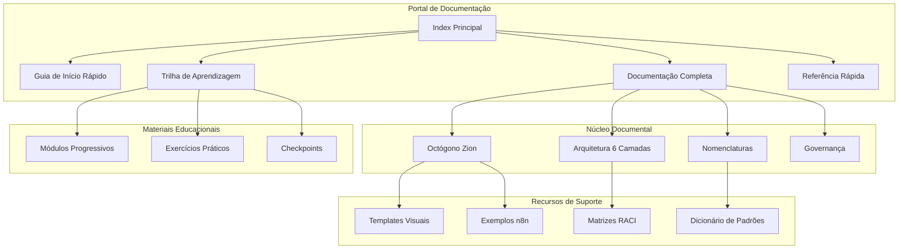
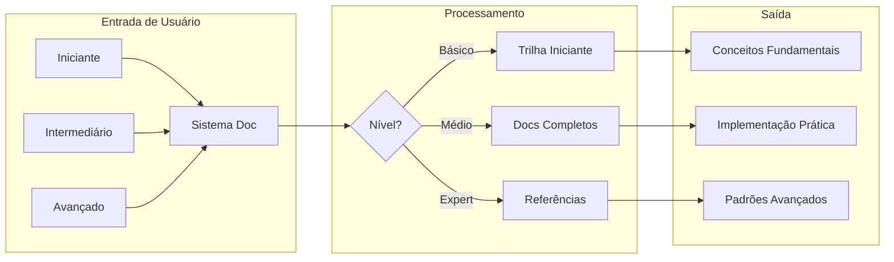
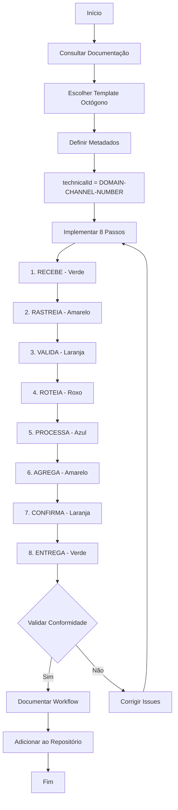
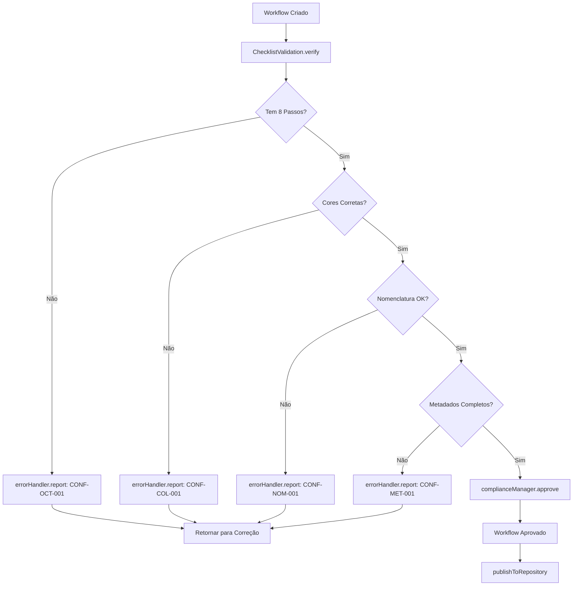
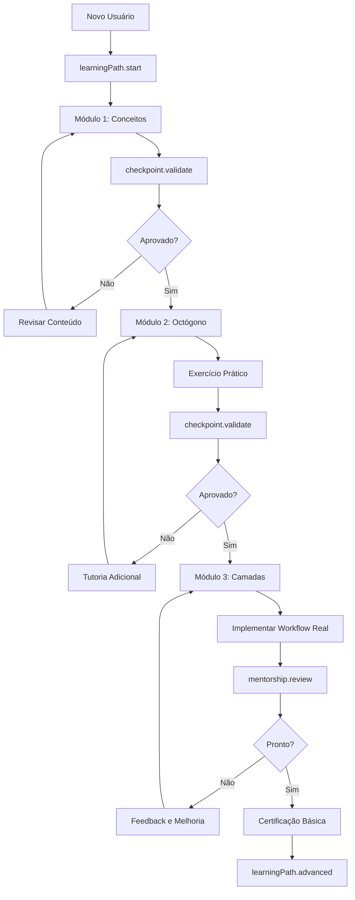
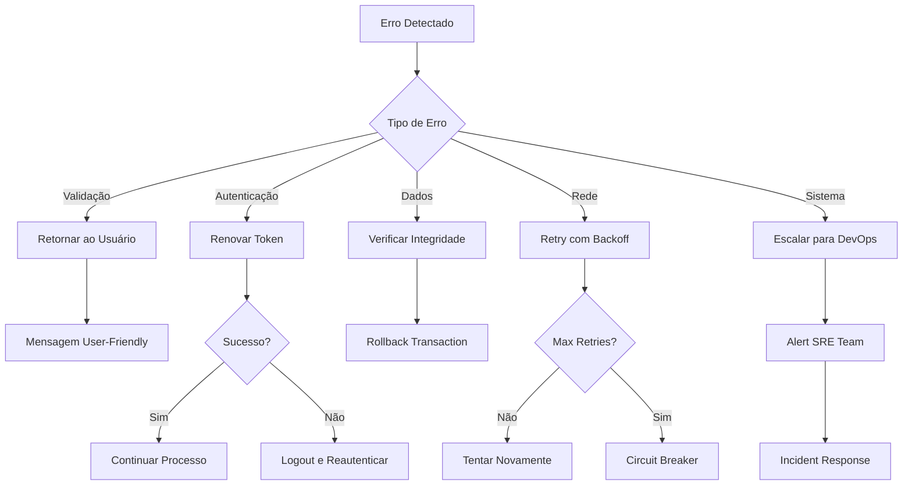
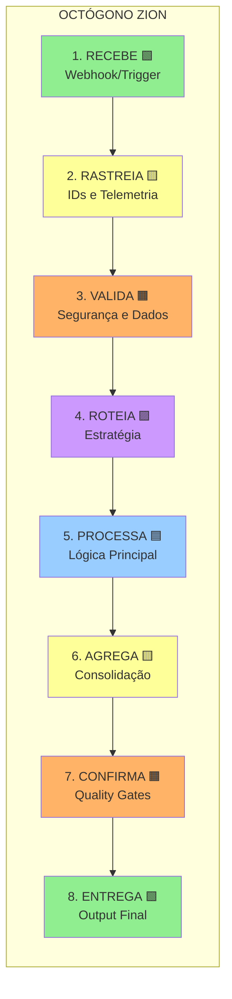
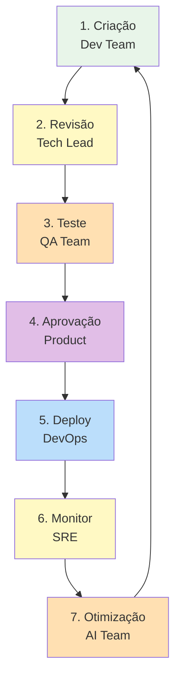

# Documento de Design - Sistema de Documentação de Nomenclatura de Camadas e Workflows

## Visão Geral

Este documento apresenta o design detalhado para um sistema completo de documentação das convenções de nomenclatura do Protocolo Zion. A solução é baseada em documentação estática em Markdown, organizando todo o conhecimento necessário para que 130+ agências e 400+ profissionais no-code implementem o protocolo de forma consistente.

### Objetivo do Design
Criar uma estrutura documental que:
- Padronize todas as convenções de nomenclatura
- Seja acessível para usuários não-técnicos
- Mantenha rigor técnico sem criar barreiras
- Permita aprendizado progressivo
- Garanta conformidade com o Octógono Zion

### Escopo
- Documentação puramente em Markdown
- Sem dependências de ferramentas externas
- Foco em clareza e acessibilidade
- Integração com materiais educacionais existentes

## Design da Arquitetura

### Diagrama da Arquitetura de Sistema



### Diagrama de Fluxo de Dados



## Design de Componentes

### Componente A: Estrutura de Arquivos

**Responsabilidades:**
- Organizar toda a documentação de forma lógica
- Facilitar navegação e descoberta
- Manter versionamento consistente

**Estrutura de Diretórios:**
```
/protocolo/nomenclatura/
├── README.md                          # Portal principal
├── OCTOGONO-ZION.md                  # Padrão mandatório 8 passos
├── CAMADAS-ARQUITETURA.md            # Arquitetura 6 camadas (A-F)
├── CONVENCOES-NOMENCLATURA.md        # Todas as convenções
├── GOVERNANCA-TIMES.md               # Estrutura e responsabilidades
├── /templates/
│   ├── octogono-basico.md
│   ├── octogono-intermediario.md
│   ├── octogono-avancado.md
│   └── /json/
│       ├── octogono-template.json
│       └── camada-templates.json
├── /exemplos/
│   ├── INT-CNX-001-completo.md
│   ├── SUP-WA-001-exemplo.md
│   └── VEN-TG-002-caso.md
├── /aprendizagem/
│   ├── 01-conceitos-basicos.md
│   ├── 02-primeiro-workflow.md
│   ├── 03-octogono-pratica.md
│   ├── 04-camadas-implementacao.md
│   └── 05-casos-avancados.md
└── /referencia/
    ├── glossario.md
    ├── faq.md
    ├── troubleshooting.md
    └── checklists.md
```

**Interfaces:**
- Links internos entre documentos
- Navegação breadcrumb em cada página
- Índice automático via headers

**Dependências:**
- Markdown padrão (CommonMark)
- Mermaid para diagramas
- Sem dependências externas

### Componente B: Sistema de Nomenclaturas

**Responsabilidades:**
- Documentar todos os padrões de nomes
- Prover exemplos práticos
- Manter consistência entre camadas

**Estrutura do Documento CONVENCOES-NOMENCLATURA.md:**

```markdown
# Convenções de Nomenclatura do Protocolo Zion

## 1. Hierarquia de Nomenclatura

### 1.1 Sistema Híbrido de 3 Níveis
- Display Name (Interface)
- Technical ID (Sistema)
- Search Tags (Descoberta)

## 2. Padrões por Componente

### 2.1 Workflows
- Padrão: [DOMAIN]-[CHANNEL]-[NUMBER]
- Exemplos com tabela de domínios

### 2.2 Nodes
- Padrão: [STEP].[TYPE]:[ACTION]
- Mapeamento com Octógono

### 2.3 Banco de Dados
- Coleções: snake_case
- Campos: tipo_prefixo_nome
- Índices: idx_tabela_campos

### 2.4 Códigos de Erro
- Padrão: [DOMAIN]-[CATEGORY]-[NUMBER]
- Taxonomia completa

## 3. Mapeamento Display/Technical
[Tabela de conversão]

## 4. Validação e Conformidade
[Checklists por tipo]
```

### Componente C: Documentação do Octógono Zion

**Responsabilidades:**
- Definir padrão mandatório de 8 passos
- Prover templates visuais e técnicos
- Garantir conformidade

**Estrutura Detalhada:**

```markdown
# Octógono Zion - Padrão Mandatório

## Os 8 Passos Obrigatórios

### 1. RECEBE 🟩 (Verde - Cor 2)
- Função: Entrada de dados
- Inputs: Webhook, Trigger, Schedule
- Outputs: Payload estruturado
- Node Pattern: 1.REC:*

### 2. RASTREIA 🟨 (Amarelo - Cor 3)
- Função: Telemetria e IDs
- Inputs: Payload do RECEBE
- Outputs: Payload + trace_id + correlation_id
- Node Pattern: 2.RAS:*

[... continua para todos 8 passos ...]

## Templates Visuais

### Template Básico
[Diagrama Mermaid completo]

### Template com Cores n8n
[Mapeamento de cores]

## Conformidade
[Checklist de validação]
```

### Componente D: Arquitetura de 6 Camadas

**Responsabilidades:**
- Documentar camadas A-F
- Definir responsabilidades por time
- Mapear workflows para camadas

**Design da Documentação:**

```markdown
# Arquitetura de 6 Camadas

## Camada A - Apresentação
- Responsável: Time Frontend
- Função: Interface com usuário
- Workflows: Webhooks, Forms
- Nomenclatura: A-*

## Camada B - Business Logic
- Responsável: Tech Lead
- Função: Regras de negócio
- Workflows: Processamento, Validação
- Nomenclatura: B-*

[... todas as 6 camadas ...]

## Matriz RACI

| Atividade | Frontend | Tech Lead | Dev | AI | DevOps |
|-----------|----------|-----------|-----|----|---------|
| Camada A  | R        | A         | C   | I  | I       |
| Camada B  | I        | R         | A   | C  | I       |

## Fluxo Entre Camadas
[Diagrama de interação]
```

### Componente E: Trilha de Aprendizagem

**Responsabilidades:**
- Prover caminho progressivo
- Incluir exercícios práticos
- Avaliar progresso

**Estrutura Modular:**

```markdown
# Módulo 1: Conceitos Básicos

## Pré-requisitos
- Conhecer n8n básico
- Ter ambiente configurado

## Objetivos
- Entender Protocolo Zion
- Conhecer Octógono
- Criar primeiro workflow

## Conteúdo

### Lição 1.1: O que é o Protocolo Zion?
[Explicação com analogias]

### Lição 1.2: Por que 8 passos?
[Justificativa do Octógono]

## Exercício Prático
1. Crie um workflow simples
2. Implemente os 8 passos
3. Valide conformidade

## Checkpoint
- [ ] Entendo os 8 passos
- [ ] Criei meu primeiro workflow
- [ ] Usei nomenclatura correta

## Próximo Módulo
→ Módulo 2: Implementando Camadas
```

## Modelos de Dados

### Estrutura de Metadados de Workflow

```typescript
interface WorkflowMetadata {
  // Identificação
  displayName: string;      // Nome em português
  technicalId: string;      // DOMAIN-CHANNEL-NUMBER
  version: string;          // Semantic versioning

  // Classificação
  layer: 'A' | 'B' | 'C' | 'D' | 'E' | 'F';
  domain: 'SUP' | 'VEN' | 'MKT' | 'FIN' | 'LOG' | 'RH' | 'TEC' | 'JUR' | 'OPR';
  channel: 'WA' | 'TG' | 'EM' | 'SMS' | 'WEB' | 'API' | 'CRM' | 'VOZ';

  // Rastreamento
  tags: string[];           // Mínimo 3 tags
  trace_id: string;         // UUID v4
  correlation_id: string;   // UUID v4

  // Conformidade
  octogonoCompliant: boolean;
  complianceChecklist: string[];
}
```

### Estrutura de Node

```typescript
interface NodeNaming {
  // Padrão: [STEP].[TYPE]:[ACTION]
  step: number;             // 1-8 para Octógono
  type: 'REC' | 'RAS' | 'VAL' | 'ROT' | 'PRO' | 'AGR' | 'CON' | 'ENT';
  action: string;           // Ação específica

  // Visual
  color: number;            // Código de cor n8n
  icon: string;            // Ícone do node

  // Documentação
  description: string;      // Em português
  purpose: string;         // Função no fluxo
}
```

### Estrutura de Código de Erro

```typescript
interface ErrorCode {
  // Padrão: [DOMAIN]-[CATEGORY]-[NUMBER]
  code: string;            // Ex: SUP-VAL-001
  domain: string;          // Domínio do erro
  category: 'VAL' | 'AUTH' | 'DATA' | 'NET' | 'SYS';
  number: string;          // Sequencial 001-999

  // Mensagens
  message_pt: string;      // Mensagem em português
  message_en: string;      // Mensagem técnica
  details: string;         // Detalhes adicionais

  // Tratamento
  severity: 'LOW' | 'MEDIUM' | 'HIGH' | 'CRITICAL';
  recoverable: boolean;
  action: string;          // Ação recomendada
}
```

## Processos de Negócio

### Processo 1: Implementação de Novo Workflow



### Processo 2: Validação de Conformidade



### Processo 3: Aprendizagem Progressiva



## Estratégia de Tratamento de Erros

### Categorias de Erro

```markdown
## Códigos de Erro por Categoria

### Validação (VAL)
- SUP-VAL-001: Campo obrigatório ausente
- SUP-VAL-002: Formato de dados inválido
- SUP-VAL-003: Tamanho excede limite

### Autenticação (AUTH)
- SUP-AUTH-001: Token expirado
- SUP-AUTH-002: Credenciais inválidas
- SUP-AUTH-003: Permissão negada

### Dados (DATA)
- SUP-DATA-001: Registro não encontrado
- SUP-DATA-002: Duplicação detectada
- SUP-DATA-003: Integridade violada

### Rede (NET)
- SUP-NET-001: Timeout de conexão
- SUP-NET-002: Serviço indisponível
- SUP-NET-003: Rate limit excedido

### Sistema (SYS)
- SUP-SYS-001: Memória insuficiente
- SUP-SYS-002: Arquivo não encontrado
- SUP-SYS-003: Processo falhou
```

### Fluxo de Tratamento



## Estratégia de Teste

### Níveis de Teste

1. **Teste de Conformidade Octógono**
   - Verificar presença dos 8 passos
   - Validar sequência correta
   - Checar cores e nomenclatura

2. **Teste de Camadas**
   - Validar isolamento entre camadas
   - Verificar interfaces corretas
   - Testar fluxo de dados

3. **Teste de Nomenclatura**
   - Validar padrões de nome
   - Checar unicidade de IDs
   - Verificar tags mínimas

### Checklist de Validação

```markdown
## Checklist de Conformidade

### Octógono Zion
- [ ] Workflow tem exatamente 8 passos principais
- [ ] Passos seguem ordem: RECEBE → RASTREIA → ... → ENTREGA
- [ ] Cores correspondem ao padrão (Verde=2, Amarelo=3, etc.)
- [ ] Cada passo tem node pattern correto (1.REC:*, 2.RAS:*, etc.)

### Nomenclatura
- [ ] Technical ID segue padrão DOMAIN-CHANNEL-NUMBER
- [ ] Display Name está em português claro
- [ ] Mínimo 3 tags relevantes
- [ ] Versionamento semântico aplicado

### Metadados
- [ ] trace_id é UUID v4 válido
- [ ] correlation_id presente
- [ ] Timestamp ISO-8601 com timezone
- [ ] Camada arquitetural definida (A-F)

### Documentação
- [ ] README específico do workflow existe
- [ ] Exemplos de uso fornecidos
- [ ] Erros possíveis documentados
- [ ] Dependências listadas
```

## Design de Templates Visuais

### Template Octógono Básico (Mermaid)



### Template JSON n8n

```json
{
  "nodes": [
    {
      "name": "1.REC:WEBHOOK",
      "type": "n8n-nodes-base.webhook",
      "position": [100, 300],
      "parameters": {
        "path": "zion-webhook",
        "responseMode": "onReceived"
      },
      "notes": "RECEBE - Entrada de dados",
      "notesInFlow": true,
      "color": 2
    },
    {
      "name": "2.RAS:TELEMETRY",
      "type": "n8n-nodes-base.function",
      "position": [300, 300],
      "parameters": {
        "code": "// Adicionar trace_id e correlation_id"
      },
      "notes": "RASTREIA - Telemetria",
      "color": 3
    }
    // ... continua para os 8 passos
  ]
}
```

## Governança e Responsabilidades

### Matriz RACI Completa

| Atividade | Frontend | Tech Lead | Dev Team | AI Team | DevOps/SRE | Product |
|-----------|----------|-----------|----------|---------|------------|----------|
| **Camada A - Apresentação** |
| Design UI | R | A | C | I | I | C |
| Webhooks | A | R | C | I | C | I |
| **Camada B - Business Logic** |
| Regras | I | R | A | C | I | C |
| Validações | I | R | A | I | I | C |
| **Camada C - Controle** |
| Roteamento | I | R | A | C | C | I |
| Orquestração | I | R | A | C | C | I |
| **Camada D - Dados** |
| Modelagem | I | A | R | C | C | I |
| Persistência | I | C | R | I | A | I |
| **Camada E - Engine** |
| IA/ML | I | C | C | R | A | I |
| Prompts | I | A | C | R | I | C |
| **Camada F - Fundação** |
| Infra | I | C | I | I | R | I |
| Monitoring | I | C | C | C | R | I |

**Legenda:**
- R = Responsável (executa)
- A = Aprovador (aprova)
- C = Consultado (contribui)
- I = Informado (notificado)

### Fluxo de Implementação em 7 Etapas



## Integração com Materiais Educacionais

### Mapeamento com Cursos

```markdown
## Alinhamento com Cursos Oficiais

### Saia da Matrix (Iniciante)
- Módulo 1 → Conceitos Básicos
- Módulo 2 → Primeiro Workflow
- Módulo 3 → Octógono Simples

### Expert em IA (Intermediário)
- Módulo 4 → Camadas Arquiteturais
- Módulo 5 → Integração com IA
- Módulo 6 → Casos Complexos

### Master Class (Avançado)
- Módulo 7 → Governança
- Módulo 8 → Otimização
- Módulo 9 → Scale Patterns
```

## Implementação de Exemplo: INT-CNX-001

### Documentação Completa

```markdown
# Workflow INT-CNX-001 - Integração de Contexto

## Metadados
- **Display Name**: Gerenciador de Contexto de Conversa
- **Technical ID**: INT-CNX-001
- **Version**: 1.0.0
- **Layer**: D (Dados)
- **Domain**: TEC (Tecnologia)
- **Channel**: API
- **Tags**: [contexto, sessão, memória, conversa]

## Implementação Octógono

### 1. RECEBE (Verde - Cor 2)
**Node**: 1.REC:API_REQUEST
- Recebe requisição com session_id
- Valida estrutura do payload
- Extrai parâmetros necessários

### 2. RASTREIA (Amarelo - Cor 3)
**Node**: 2.RAS:ADD_TRACKING
- Gera trace_id único
- Adiciona correlation_id
- Marca timestamp ISO-8601

### 3. VALIDA (Laranja - Cor 4)
**Node**: 3.VAL:CHECK_SESSION
- Verifica se session_id existe
- Valida permissões de acesso
- Checa limites de rate

### 4. ROTEIA (Roxo - Cor 5)
**Node**: 4.ROT:DEFINE_ACTION
- Determina se é GET ou SET
- Define estratégia de cache
- Escolhe backend apropriado

### 5. PROCESSA (Azul - Cor 7)
**Node**: 5.PRO:CONTEXT_LOGIC
- Recupera contexto do Redis
- Atualiza com novos dados
- Aplica TTL configurado

### 6. AGREGA (Amarelo - Cor 3)
**Node**: 6.AGR:MERGE_DATA
- Consolida contexto atual
- Merge com histórico
- Prepara resposta

### 7. CONFIRMA (Laranja - Cor 4)
**Node**: 7.CON:VALIDATE_OUTPUT
- Verifica integridade
- Checa tamanho máximo
- Valida formato

### 8. ENTREGA (Verde - Cor 2)
**Node**: 8.ENT:SEND_RESPONSE
- Retorna contexto atualizado
- Inclui metadados
- Fecha telemetria
```

## Conclusão do Design

Este design fornece uma estrutura completa e coesa para documentar todas as convenções de nomenclatura do Protocolo Zion. A implementação seguirá os seguintes princípios:

1. **Acessibilidade**: Linguagem clara, exemplos práticos, sem jargão desnecessário
2. **Progressividade**: Do básico ao avançado, com checkpoints claros
3. **Conformidade**: Octógono Zion como padrão mandatório central
4. **Praticidade**: Templates prontos, exemplos reais, casos de uso
5. **Governança**: Responsabilidades claras, processos definidos

### Próximos Passos

1. Implementar estrutura de arquivos conforme design
2. Criar conteúdo para cada documento
3. Desenvolver templates visuais e técnicos
4. Validar com usuários piloto
5. Iterar baseado em feedback

### Métricas de Sucesso

- 100% dos workflows seguindo Octógono
- Redução de 50% em erros de nomenclatura
- Tempo de onboarding < 1 semana
- Score de satisfação > 4.5/5
- Taxa de conformidade > 95%