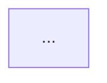

# CLAUDE.md

This file provides guidance to Claude Code (claude.ai/code) when working with code in this repository.

## Repository Overview

This is the **Protocolo de Agentes No-Code Zion (PANZ)** documentation repository - an open standard for developing intelligent conversational agents using no-code/low-code tools, primarily n8n. The protocol combines technical rigor with no-code accessibility.

## Key Architecture Concepts

### 8-Step Pattern (Core of the Protocol)

All n8n workflows MUST follow this mandatory 8-step pattern with standardized colors:

1. **RECEBE** 🟩 - Receives data from multiple sources
2. **RASTREIA** 🟨 - Generates unique IDs and telemetry
3. **VALIDA** 🟧 - Validates data and security
4. **ROTEIA** 🟪 - Defines processing strategy
5. **PROCESSA** 🟦 - Executes main logic with AI
6. **AGREGA** 🟨 - Consolidates multiple results
7. **CONFIRMA** 🟧 - Quality gates and compliance
8. **ENTREGA** 🟩 - Final output to destination

### Hybrid 3-Layer Naming System

The protocol uses a hybrid naming system to be accessible for beginners while maintaining technical standards:

1. **Display Name** (User Interface): Clear Portuguese descriptions
2. **Technical ID** (System): Pattern `[DOMAIN]-[CHANNEL]-[NUMBER]` (e.g., `SUP-WA-001`)
3. **Search Tags** (Discovery): Keywords for indexing

Domain codes: `SUP` (Support), `VEN` (Sales), `MKT` (Marketing), `FIN` (Financial), `LOG` (Logistics), `RH` (HR), `TEC` (Tech), `JUR` (Legal), `OPR` (Operations)

Channel codes: `WA` (WhatsApp), `TG` (Telegram), `EM` (Email), `SMS`, `WEB`, `API`, `CRM`, `VOZ` (Voice)

### Node Naming Convention

Inside workflows: `[STEP].[TYPE]:[ACTION]`
- Example: `5.PRO:AI_LOGIC` (Step 5, Process, AI Logic execution)

## Repository Structure

```
/protocolo              # Protocol specifications and methodology
  /metodologia          # 8-Step pattern implementation guides
  /componentes          # Component documentation (Context Manager, etc.)
  /templates            # Visual templates and examples
  /ARQUITETURA-MERMAID.md  # Complete architecture diagrams
  /NOMENCLATURAS-ZION.md   # Comprehensive naming conventions

/templates              # n8n workflow templates (future)
/exemplos              # Implementation examples (future)

Key documents:
- PROTOCOLO-ZION.md     # Main protocol specification
- BRIEF.md              # Project context and planning
- README.md             # Public-facing documentation
```

## Development Commands

This is a documentation repository, so there are no build/test commands. However, when working with n8n workflows:

### Git Operations
```bash
git add -A
git commit -m "type: description following conventional commits"
git status
```

### PostgreSQL Database Setup (for Context Manager)
```sql
-- Create database
CREATE DATABASE zion_chatbot;

-- Basic tables structure is in:
-- protocolo/componentes/CONTEXT-MANAGER-DATABASE.md
```

## Critical Implementation Details

### Mandatory Metadata for Workflows

Every workflow must include:
```javascript
{
  "displayName": "Human-readable Portuguese name",
  "technicalId": "DOM-CHAN-001",
  "version": "1.0.0",  // Semantic versioning
  "tags": ["minimum", "three", "tags"],
  "trace_id": "UUID-v4",
  "correlation_id": "UUID-v4"
}
```

### Timestamps
Always use ISO-8601 format with timezone: `2024-01-20T10:00:00Z`

### Error Codes
Pattern: `[DOMAIN]-[CATEGORY]-[NUMBER]`
- Example: `SUP-VAL-001` (Support domain, Validation error, number 001)

### Log Format
```
[TIMESTAMP] [WORKFLOW_ID] [STEP] [LEVEL] [TRACE_ID] [MESSAGE]
```

## Working with Mermaid Diagrams

Use `mermaid` (not `mermaidjs`) for VSCode extension compatibility:
```markdown


## Documentation Philosophy

1. **Names are documentation** - In no-code, the name IS the documentation
2. **Function over form** - What it does matters more than architecture
3. **Natural discovery** - Users should find what they need on first guess
4. **No entry barriers** - Beginners understand in 5 minutes
5. **Portuguese for display, English for technical** - Never mix languages at the same level

## Key Files to Understand

1. **protocolo/NOMENCLATURAS-ZION.md** - Complete naming conventions and standards
2. **protocolo/metodologia/README.md** - 8-Step pattern detailed implementation
3. **protocolo/ARQUITETURA-MERMAID.md** - Visual architecture diagrams
4. **protocolo/componentes/CONTEXT-MANAGER-DATABASE.md** - Database structure for beginners

## Protocol Version

Current: **v1.0.0** (Draft status)

Stack: n8n + PostgreSQL + Redis + LLMs (OpenAI, Anthropic, Llama)