# Zion Protocol

> **Versão:** 1.0.0
> **Status:** Draft
> **Última Atualização:** Dezembro 2024

## Resumo Executivo

O **Zion Protocol** é um padrão aberto para desenvolvimento e orquestração de agentes conversacionais inteligentes utilizando ferramentas no-code/low-code. Este protocolo define especificações técnicas, metodologias de implementação e melhores práticas para criar soluções de IA conversacional escaláveis e mantíveis sem necessidade de programação tradicional.

## 1. Introdução

### 1.1 Motivação

O mercado de chatbots e agentes conversacionais cresce exponencialmente, mas enfrenta barreiras significativas:
- Alto custo de desenvolvimento customizado
- Dependência excessiva de programadores especializados
- Falta de padronização entre implementações
- Dificuldade de manutenção e evolução

O PANZ surge para democratizar o acesso a tecnologias de IA conversacional, estabelecendo um protocolo que une rigor técnico com acessibilidade no-code.

### 1.2 Objetivos

- **Padronizar** a implementação de agentes conversacionais
- **Simplificar** o desenvolvimento através de ferramentas no-code
- **Garantir** qualidade através de metodologias estruturadas
- **Acelerar** entregas com templates e componentes reutilizáveis
- **Democratizar** acesso a IA conversacional avançada

### 1.3 Escopo

Este protocolo abrange:
- Arquitetura de referência para agentes conversacionais
- Especificação de interfaces e comunicação
- Metodologia de implementação (Octógono Zion)
- Stack tecnológica recomendada
- Templates e componentes reutilizáveis
- Métricas e observabilidade

## 2. Arquitetura do Protocolo

### 2.1 Visão Geral

```mermaid
graph TB
    %% Configuração de estilos
    classDef interfaceClass fill:#FF9800,stroke:#E65100,color:#FFF,stroke-width:3px
    classDef normClass fill:#FFEB3B,stroke:#F9A825,color:#000,stroke-width:2px
    classDef processClass fill:#FFEB3B,stroke:#F9A825,color:#000,stroke-width:4px
    classDef aiClass fill:#2196F3,stroke:#1565C0,color:#FFF,stroke-width:3px
    classDef integClass fill:#F44336,stroke:#C62828,color:#FFF,stroke-width:2px
    classDef obsClass fill:#9E9E9E,stroke:#616161,color:#FFF,stroke-width:2px

    %% Camada de Interface - Entrada
    subgraph " "
        direction TB
        Interface["🌐 INTERFACE DE ENTRADA"]
        WA["💬 WhatsApp"]
        TG["📱 Telegram"]
        WEB["🌐 WebChat"]
        DC["💬 Discord"]
        EM["📧 Email"]
        VOZ["🎙️ Voice"]
    end

    %% Camada de Normalização
    subgraph "  "
        direction TB
        Norm["⚙️ NORMALIZAÇÃO"]
        Factory["🏭 Factory Pattern"]
        Adapt["🔌 Adaptadores"]
        Valid["✅ Validadores"]
    end

    %% Núcleo - Octogono Zion
    subgraph "   "
        direction TB
        Octo["🔷 OCTOGONO ZION<br/>━━━━━━━━━━━━━━━<br/>8 Steps Obrigatórios"]
        R["1️⃣ RECEBE 🟠"]
        T["2️⃣ RASTREIA ⬜"]
        V["3️⃣ VALIDA 🟢"]
        RO["4️⃣ ROTEIA 🔵"]
        P["5️⃣ PROCESSA 🟡"]
        AG["6️⃣ AGREGA ⬜"]
        C["7️⃣ CONFIRMA 🟢"]
        E["8️⃣ ENTREGA 🟠"]
    end

    %% Camada de Inteligência
    subgraph "    "
        direction TB
        AI["🧠 INTELIGÊNCIA ARTIFICIAL"]
        LLM["🤖 LLMs (GPT/Claude/Llama)"]
        NLU["💭 NLU & Compreensão"]
        CTX["📚 Contexto & Memória"]
        DEC["⚡ Motor de Decisão"]
    end

    %% Camada de Integração
    subgraph "     "
        direction TB
        Integ["🔗 INTEGRAÇÕES"]
        API["🌐 APIs REST/GraphQL"]
        DB["💾 Databases"]
        CRM["📊 CRMs"]
        ERP["🏢 ERPs"]
        LEG["🏛️ Legacy Systems"]
    end

    %% Camada de Observabilidade
    subgraph "      "
        direction TB
        Obs["📊 OBSERVABILIDADE"]
        LOG["📝 Logs Estruturados"]
        MET["📈 Métricas"]
        TRC["🔍 Traces"]
        ALT["🚨 Alertas"]
        ANL["📊 Analytics"]
    end

    %% Conexões principais
    Interface ==> Norm
    WA & TG & WEB & DC & EM & VOZ -.-> Interface

    Norm ==> Octo
    Factory & Adapt & Valid -.-> Norm

    Octo ==> AI
    R & T & V & RO & P & AG & C & E -.-> Octo

    AI ==> Octo
    LLM & NLU & CTX & DEC -.-> AI

    Octo ==> Integ
    API & DB & CRM & ERP & LEG -.-> Integ

    %% Observabilidade monitora tudo
    Norm -.->|monitora| Obs
    Octo -.->|monitora| Obs
    AI -.->|monitora| Obs
    Integ -.->|monitora| Obs
    LOG & MET & TRC & ALT & ANL -.-> Obs

    %% Aplicar estilos
    class Interface,WA,TG,WEB,DC,EM,VOZ interfaceClass
    class Norm,Factory,Adapt,Valid normClass
    class Octo,R,T,V,RO,P,AG,C,E processClass
    class AI,LLM,NLU,CTX,DEC aiClass
    class Integ,API,DB,CRM,ERP,LEG integClass
    class Obs,LOG,MET,TRC,ALT,ANL obsClass
```



### 2.2 Componentes Principais

#### 2.2.1 Agente Conversacional
Entidade autônoma capaz de:
- Receber e interpretar mensagens
- Manter contexto de conversação
- Tomar decisões baseadas em regras e IA
- Executar ações e integrações
- Responder de forma coerente

#### 2.2.2 Orquestrador (n8n)
Responsável por:
- Gerenciar fluxo de execução
- Coordenar múltiplos agentes
- Garantir resiliência e recuperação
- Versionar e deployar workflows
- Monitorar execuções

#### 2.2.3 Context Manager
Mantém:
- Estado da conversação
- Histórico de interações
- Preferências do usuário
- Dados de sessão
- Memória de longo prazo

## 3. Especificação Técnica

### 3.1 O Octógono Zion

**IMPORTANTE**: O Octógono Zion é aplicado em TODOS os fluxos de processamento, sem exceção. Todo workflow, independente do tipo ou complexidade, DEVE seguir os 8 passos obrigatórios:

#### Step 1: RECEBE
- Recebe dados de entrada (Workflow/Webhook/RabbitMQ/Evaluations)
- Identifica origem e tipo de mensagem
- Prepara contexto inicial
- **Cor no n8n**: Laranja 🟠 (color: 2)
- **Prefixo**: `A:` (quando chama outra camada)

#### Step 2: RASTREIA
- Gera IDs únicos (trace_id, correlation_id, session_id)
- Captura timestamp e metadados
- Inicia telemetria e observabilidade
- Registra evento de entrada
- **Cor no n8n**: Cinza ⬜ (color: 7)
- **Prefixo**: `RAS:` (operação local)

#### Step 3: VALIDA
- Valida estrutura e formato dos dados
- Verifica permissões e segurança
- Aplica regras de negócio
- **Cor no n8n**: Verde 🟢 (color: 4)
- **Prefixo**: `VAL:` (operação local)
- Valida estrutura e formato dos dados
- Verifica permissões e autorizações
- Aplica filtros de segurança e sanitização
- Rejeita entradas inválidas com erro apropriado
- **Cor no n8n**: Laranja 🟧

#### Step 4: ROTEIA
- Analisa intenção e contexto
- Define estratégia de processamento
- Seleciona agente/skill/workflow apropriado
- Determina prioridade e SLA
- **Cor no n8n**: Azul 🔵 (color: 5)
- **Prefixo**: `ROT:` (operação local)

#### Step 5: PROCESSA
- Executa lógica principal de negócio
- Processa com LLM/IA quando necessário
- Acessa integrações e APIs externas
- Transforma e enriquece dados
- **Cor no n8n**: Amarelo 🟡 (color: 3)
- **Prefixos**: `B:` (Normalização), `C:` (Processamento), `E:` (Integração)

#### Step 6: AGREGA
- Consolida resultados de múltiplas fontes
- Combina respostas de diferentes processamentos
- Monta payload de resposta completo
- Adiciona metadados e contexto
- **Cor no n8n**: Cinza ⬜ (color: 7)
- **Prefixos**: `AGG:` (local) ou `E:AGG:` (camada E)

#### Step 7: CONFIRMA
- Executa quality gates finais
- Valida resposta contra políticas
- Verifica compliance e governança
- Aplica filtros de conteúdo
- **Cor no n8n**: Verde 🟢 (color: 4)
- **Prefixo**: `VAL:` (validação final)

#### Step 8: ENTREGA
- Formata resposta final
- Atualiza estado e contexto
- Envia ao destino (canal/sistema)
- Confirma entrega e fecha ciclo
- **Cor no n8n**: Laranja 🟠 (color: 2)
- **Prefixo**: `C:` (quando executa workflow)

### 3.2 Estados do Agente


## 4. Stack Tecnológica

### 4.1 Core (Obrigatório)

| Componente | Tecnologia | Versão Mínima |
|------------|------------|---------------|
| Orquestrador | n8n | 1.0+ |
| Database | PostgreSQL | 14+ |
| Runtime | Node.js | 18+ |

### 4.2 Recomendado

| Componente | Opções |
|------------|---------|
| Vector DB | Pinecone, Qdrant, pgvector |
| Cache | Redis |
| LLM | OpenAI, Anthropic, Llama |
| Interface | Chatwoot, Evolution API |
| Monitoring | Grafana, Prometheus |

## 5. Implementação

### 5.1 Nomenclatura Padrão

#### Nodes COM Letra (executeWorkflow entre camadas)
```javascript
"A:Recebe dados conexao"        // Interface
"B:NOR:Conexao > sistema"       // Normalização
"C:CMP:Executa motor"           // Processamento
"D:LLM:Processar prompt"        // Inteligência
"E:CNV:Converte midia"          // Integração
"F:LOG:Registrar evento"        // Observabilidade
```

#### Nodes SEM Letra (operação local)
```javascript
"VAL:ParametrosValidos"         // Validação
"ROT:SelecionaEstrategia"       // Roteamento
"RAS:Execução tratador"         // Rastreamento
"AGG:UnificaMidia"              // Agregação
"ERR:Parametros"                // Erro
```

### 5.2 Estrutura de Projeto

```
projeto-zion/
├── workflows/
│   ├── (A) Interface/      # Entrada de dados, webhooks
│   ├── (B) Normalizacao/   # Transformações, adaptadores
│   ├── (C) Processamento/  # Lógica principal
│   ├── (D) Inteligencia/   # IA, LLMs
│   ├── (E) Integracao/     # APIs externas, bancos
│   ├── (F) Observabilidade/# Logs, métricas
│   └── 5-utilities/       # Helpers
├── templates/
│   ├── agent-basic/       # Template básico
│   ├── agent-sales/       # Template vendas
│   └── agent-support/     # Template suporte
├── config/
│   ├── credentials.json   # Credenciais
│   ├── environment.json   # Variáveis
│   └── prompts.json       # Prompts IA
├── docs/
│   ├── setup.md          # Instalação
│   ├── architecture.md   # Arquitetura
│   └── api.md           # Documentação API
└── tests/
    ├── unit/             # Testes unitários
    └── e2e/              # Testes ponta a ponta
```

### 5.2 Fluxo de Implementação

1. **Setup Inicial**
   - Instalar n8n e PostgreSQL
   - Configurar credenciais
   - Importar templates base

2. **Desenvolvimento**
   - Criar workflows implementando SEMPRE o Octógono Zion completo
   - Todos os fluxos devem ter os 8 steps, independente da complexidade
   - Implementar integrações necessárias
   - Configurar prompts e regras

3. **Testes**
   - Validar cada step isoladamente
   - Testar fluxo completo
   - Verificar métricas de qualidade

4. **Deploy**
   - Versionar workflows
   - Configurar monitoring
   - Documentar implementação

## 6. Segurança

### 6.1 Requisitos Mínimos

- **Autenticação**: Todos endpoints protegidos
- **Criptografia**: TLS 1.2+ para comunicação
- **Sanitização**: Validação de todas entradas
- **Rate Limiting**: Proteção contra abuso
- **Auditoria**: Log de todas operações

### 6.2 Proteção de Dados

- Conformidade com LGPD/GDPR
- Anonimização de dados sensíveis
- Retenção limitada de histórico
- Direito ao esquecimento

## 7. Métricas e KPIs

### 7.1 Métricas Técnicas

- **Latência**: Tempo de resposta (p50, p95, p99)
- **Disponibilidade**: Uptime do serviço
- **Taxa de Erro**: Percentual de falhas
- **Throughput**: Mensagens por segundo

### 7.2 Métricas de Negócio

- **Taxa de Resolução**: Problemas resolvidos sem humano
- **Satisfação (CSAT)**: Score de satisfação
- **Tempo de Resolução**: Duração média de atendimento
- **Taxa de Deflexão**: Redução de tickets

## 8. Conformidade e Certificação

### 8.1 Níveis de Conformidade

- **Bronze**: Implementação do Octógono em TODOS os fluxos
- **Silver**: + Observabilidade completa
- **Gold**: + Segurança e compliance
- **Platinum**: + Contribuição ao protocolo

### 8.2 Processo de Certificação

1. Auto-avaliação com checklist
2. Submissão de implementação
3. Revisão pela comunidade
4. Emissão de certificado

## 9. Governança

### 9.1 Versionamento

Segue [Semantic Versioning](https://semver.org/):
- MAJOR: Mudanças incompatíveis
- MINOR: Novas funcionalidades
- PATCH: Correções

### 9.2 Contribuições

- Issues e PRs no repositório oficial
- RFC para mudanças significativas
- Votação da comunidade para major changes

## 10. Referências

- [n8n Documentation](https://docs.n8n.io)
- [OpenAI API Reference](https://platform.openai.com/docs)
- [PostgreSQL Documentation](https://www.postgresql.org/docs)
- [JSON Schema](https://json-schema.org)

## Apêndices

### A. Glossário

- **Agente**: Entidade autônoma de processamento
- **Workflow**: Fluxo de trabalho no n8n
- **Factory**: Padrão para normalização de dados
- **Trace**: Rastreamento de execução
- **Context**: Estado mantido entre interações

### B. Exemplos de Implementação

Disponíveis no repositório:
- `/examples/basic-agent`
- `/examples/sales-agent`
- `/examples/support-agent`

### C. FAQ

**Q: Posso usar outras ferramentas além do n8n?**
A: O protocolo é otimizado para n8n, mas os conceitos podem ser adaptados.

**Q: É necessário usar todos os 8 passos do Octógono?**
A: Sim, TODOS os fluxos devem implementar os 8 passos do Octógono, sem exceção. Esta é a base fundamental do protocolo.

**Q: Posso usar em produção?**
A: Sim, o protocolo está pronto para ambientes produtivos.

---

## Licença

Este protocolo é distribuído sob licença MIT. Veja [LICENSE](LICENSE) para detalhes.

## Comunidade

- **GitHub**: github.com/zion-protocol
- **Discord**: discord.gg/zion-protocol
- **Forum**: community.zion-protocol.org

---

*Protocolo de Agentes No-Code Zion - Democratizando IA Conversacional*