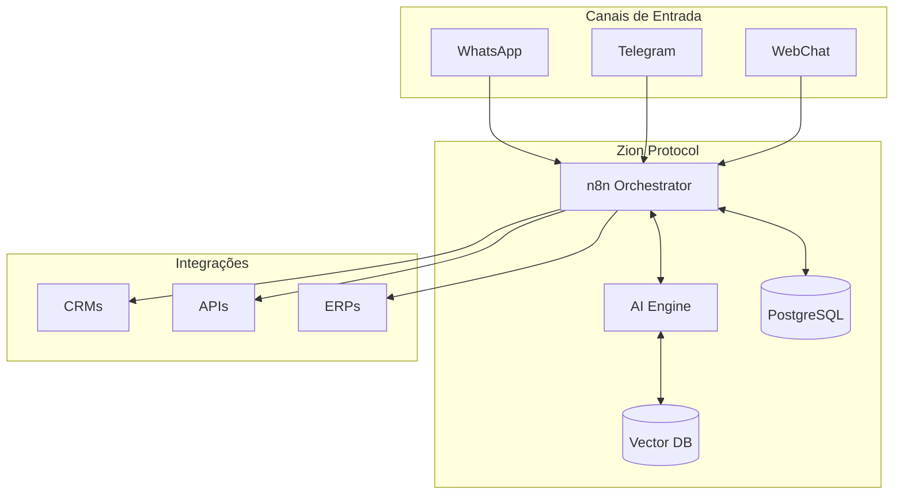

# Zion Protocol

<div align="center">


**Padrão aberto para desenvolvimento de agentes conversacionais inteligentes com ferramentas no-code**

[Documentação](./PROTOCOLO-ZION.md) • [Quick Start](#-quick-start) • [Exemplos](./exemplos) • [Comunidade](#-comunidade)

</div>

## 🎯 O que é o Zion Protocol?

O **Zion Protocol** é um padrão aberto que democratiza o desenvolvimento de chatbots e agentes de IA, combinando:

- ✅ **Protocolo Técnico** - Especificações claras de arquitetura e comunicação
- ✅ **Metodologia Prática** - Octógono Zion para garantir qualidade
- ✅ **Stack Open Source** - Ferramentas gratuitas (n8n, PostgreSQL, Langchain)
- ✅ **Templates Prontos** - Acelere com workflows pré-construídos e testados

## 🚀 Por que usar o Zion Protocol?

### Para Empresas
- **80% menos custo** que desenvolvimento tradicional
- **10x mais rápido** para implementar
- **Sem dependência** de programadores
- **Manutenção simplificada** por equipes internas

### Para Implementadores
- **Padrão consolidado** para todos os projetos
- **Componentes reutilizáveis** entre clientes
- **Observabilidade nativa** em todas implementações
- **Comunidade ativa** para suporte

## 🏗️ Arquitetura do Protocolo



## 📋 O Octógono Zion

Toda implementação do Zion Protocol segue os 8 passos obrigatórios do Octógono com cores padronizadas no n8n:

```
1️⃣ RECEBE    🟩 → Recebe dados de múltiplas origens
2️⃣ RASTREIA  🟨 → Gera IDs únicos e telemetria
3️⃣ VALIDA    🟧 → Verifica dados e segurança
4️⃣ ROTEIA    🟪 → Define estratégia de processamento
5️⃣ PROCESSA  🟦 → Executa lógica principal com IA
6️⃣ AGREGA    🟨 → Consolida resultados múltiplos
7️⃣ CONFIRMA  🟧 → Quality gates e compliance
8️⃣ ENTREGA   🟩 → Output final ao destino
```

## 🛠️ Tecnologias Principais

- **n8n**: Plataforma de automação no-code
- **WhatsApp Business API**: Para integração com WhatsApp
- **Telegram Bot API**: Para bots no Telegram
- **OpenAI/Anthropic**: Para IA conversacional
- **Webhook**: Para integrações customizadas

## 🚦 Como Começar

1. **Leia a documentação de introdução** para entender os conceitos
2. **Siga o guia de preparação** para mapear suas necessidades
3. **Use os templates** disponíveis para acelerar a implementação
4. **Consulte os casos de uso** para inspiração e referência
5. **Aplique as boas práticas** para garantir qualidade

## 📂 Estrutura do Repositório

```
documentacao/
├── docs/                    # Documentação principal
│   ├── 01-introducao/       # Conceitos introdutórios
│   ├── 02-fundamentos/      # Base teórica e técnica
│   ├── 03-preparacao/       # Planejamento e análise
│   ├── 04-implementacao/    # Guias práticos
│   ├── 05-casos-de-uso/     # Exemplos reais
│   ├── 06-boas-praticas/    # Recomendações
│   └── 07-recursos/         # Material adicional
├── templates/               # Templates de workflows n8n
├── exemplos/               # Exemplos de implementação
├── assets/                 # Imagens, diagramas e recursos visuais
└── README.md               # Este arquivo
```

## 🤝 Contribuindo

Contribuições são bem-vindas! Se você tem experiência com implementação de chatbots ou n8n, considere:
- Compartilhar casos de uso
- Sugerir melhorias na metodologia
- Reportar erros ou inconsistências
- Adicionar novos templates

## 📝 Licença

Este projeto está sob licença MIT. Veja o arquivo [LICENSE](LICENSE) para mais detalhes.

## 📧 Contato

Para dúvidas, sugestões ou consultoria sobre implementação da Metodologia Zion, entre em contato.

---

**Zion Protocol** - Transformando empresas através de automação inteligente e acessível.