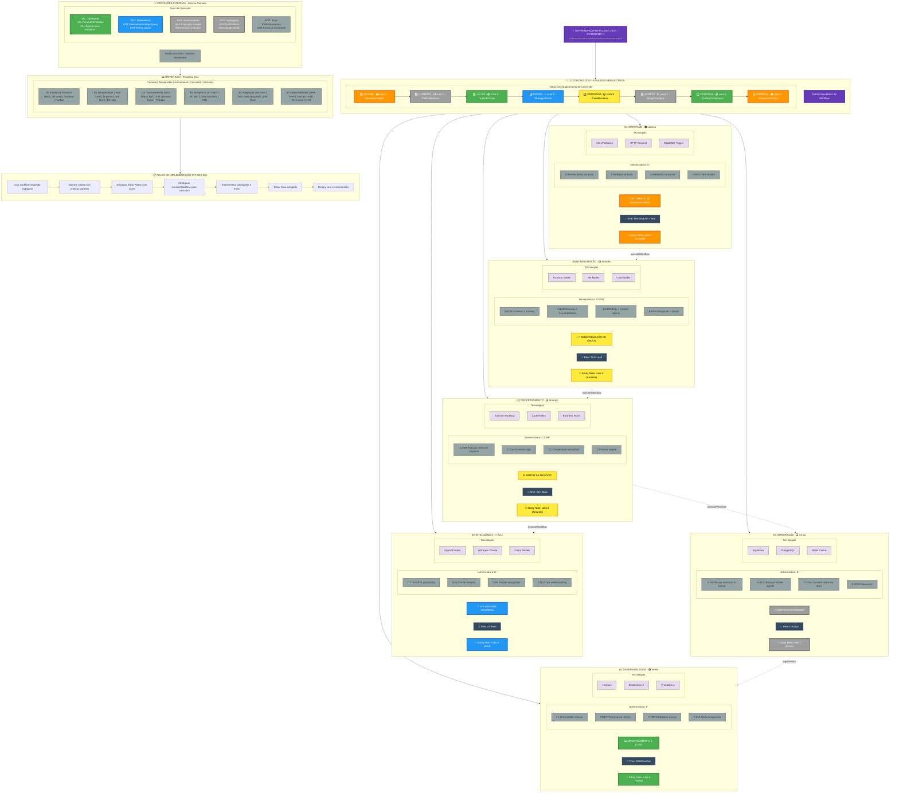

# Organograma - Protocolo Zion com Octógono

## 🏗️ Arquitetura em Camadas - Padrão INT-CNX-001



## 📍 Legenda de Cores n8n

| Cor n8n | Código | Hexadecimal | Uso no Octógono | Camadas |
|---------|--------|-------------|-----------------|---------|
| 🟠 Laranja | color:2 | #FF9800 | Steps 1 & 8 (RECEBE/ENTREGA) | (A) Interface |
| 🟡 Amarelo | color:3 | #FFEB3B | Step 5 (PROCESSA) | (B) Normalização, (C) Processamento |
| 🟢 Verde | color:4 | #4CAF50 | Steps 3 & 7 (VALIDA/CONFIRMA) | (F) Observabilidade |
| 🔵 Azul | color:5 | #2196F3 | Step 4 (ROTEIA) | (D) Inteligência |
| ⬜ Cinza | color:7 | #9E9E9E | Steps 2 & 6 (RASTREIA/AGREGA) | (E) Integração |

## 🎯 Regras de Nomenclatura

### Com Letra (executeWorkflow - Entre Camadas)
- `A:` - Interface (webhooks, APIs)
- `B:` - Normalização (transformações)
- `C:` - Processamento (motor principal)
- `D:` - Inteligência (IA/LLMs)
- `E:` - Integração (serviços externos)
- `F:` - Observabilidade (logs, métricas)

### Sem Letra (Operações Internas - Mesma Camada)
- `VAL:` - Validações
- `ROT:` - Roteamento
- `RAS:` - Rastreamento
- `AGG:` - Agregação
- `ERR:` - Tratamento de erros

## 📂 Estrutura de Pastas no n8n

```
Personal / Sandro Borges / Jana - Aprendizado /
  ├── (A) Interface         # 🟠 color:2
  ├── (B) Normalização      # 🟡 color:3
  ├── (C) Processamento     # 🟡 color:3
  ├── (D) Inteligência      # 🔵 color:5
  ├── (E) Integração        # ⬜ color:7
  └── (F) Observabilidade   # 🟢 color:4
```

## ✅ Checklist de Implementação

- [ ] Workflow segue os 8 passos do Octógono
- [ ] Cores das Sticky Notes correspondem ao mapeamento
- [ ] Nomenclatura com letra para executeWorkflow
- [ ] Nomenclatura sem letra para operações internas
- [ ] Metadados com protocol: "ZION-v1.0"
- [ ] Pattern identificado (ex: INT-CNX-001)
- [ ] Versionamento semântico aplicado

---

*Baseado no padrão INT-CNX-001 - Implementação de referência do Protocolo Zion*