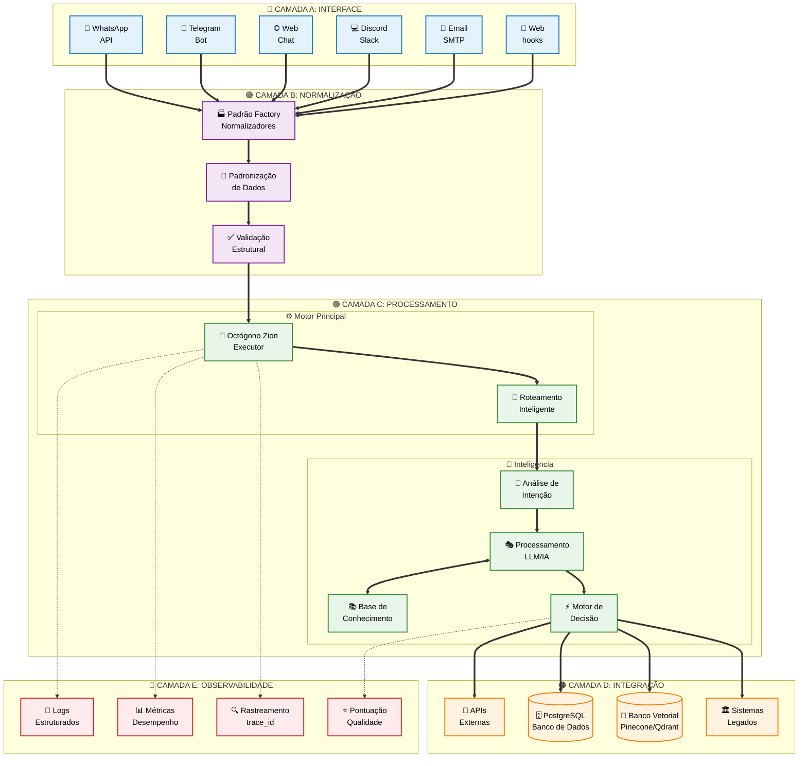
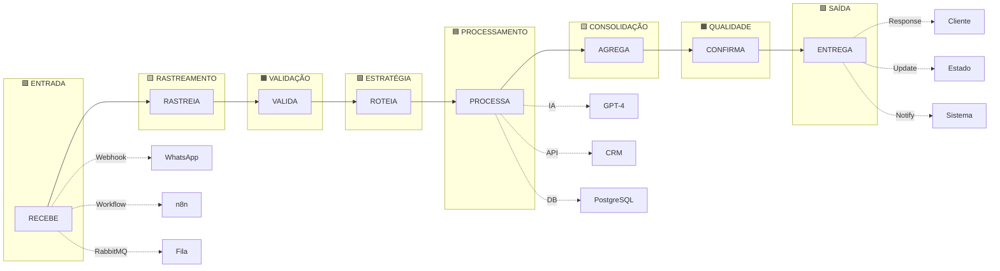
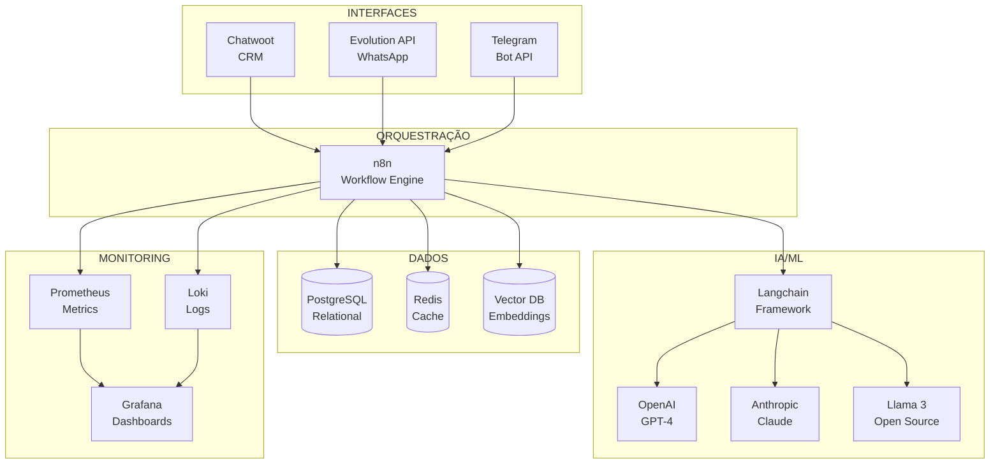
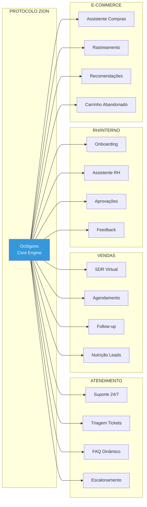
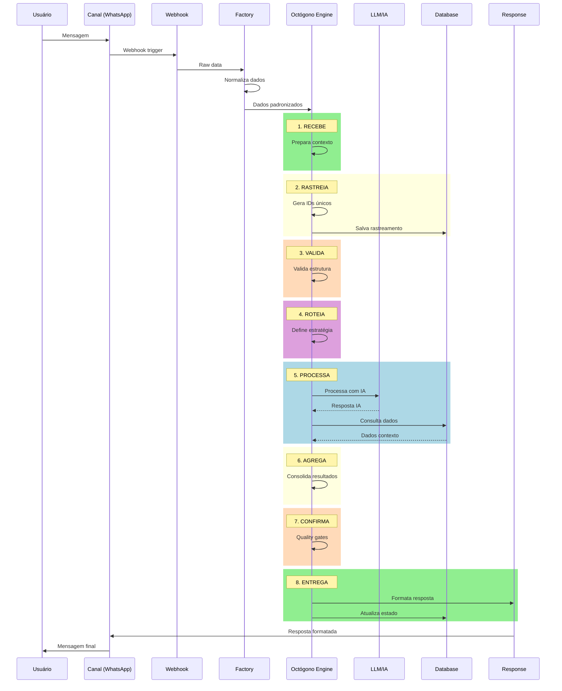
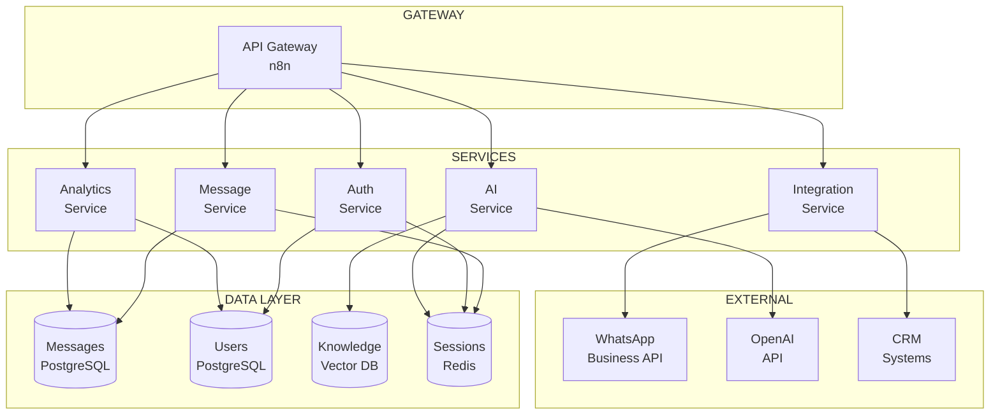
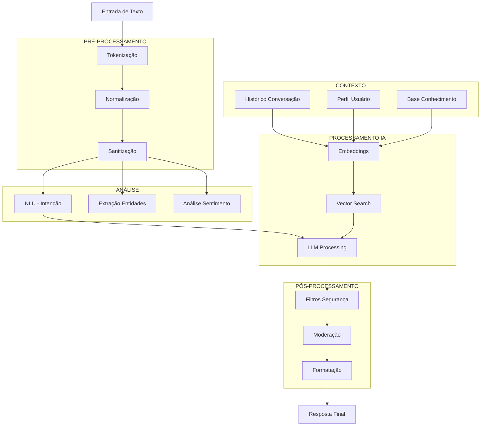
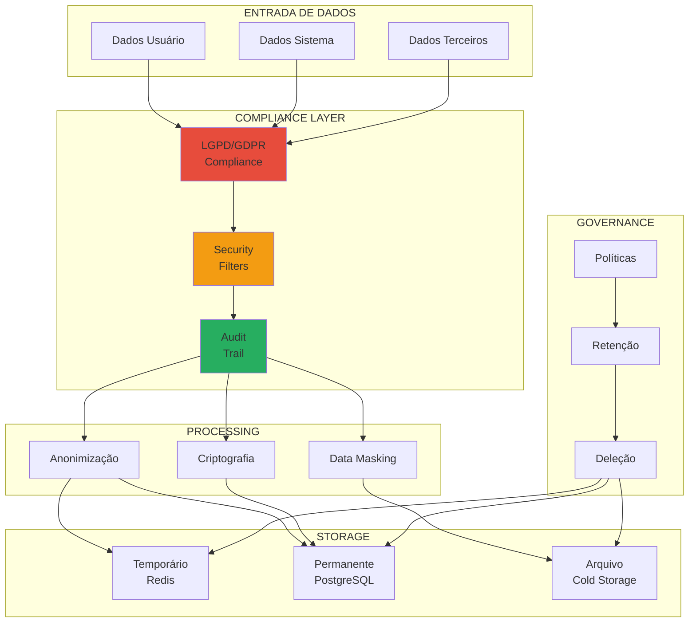
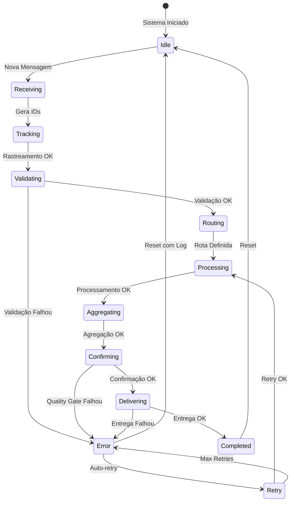
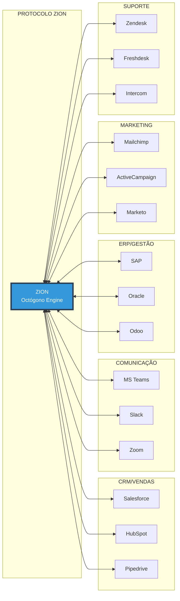

# 🏗️ Arquitetura do Protocolo ZION - Diagramas Mermaid

## 1. Arquitetura Geral do Sistema

## 2. Fluxo do Padrão Octógono

## 3. Stack Técnica Completa

## 4. Casos de Uso por Domínio

## 5. Fluxo de Dados Detalhado

## 6. Arquitetura de Microsserviços

## 7. Pipeline de Processamento IA

## 8. Modelo de Governança e Compliance

## 9. Ciclo de Vida da Sessão

## 10. Integração com Ecossistema Empresarial

---

*Diagramas da Arquitetura - Protocolo ZION v3.0*