# 🏗️ Arquitetura do Protocolo ZION - Diagramas Mermaid

## 1. Arquitetura Geral do Sistema

```mermaid
graph TB
    subgraph "CAMADA 1: INTERFACE"
        WA[WhatsApp API]
        TG[Telegram Bot]
        WC[WebChat]
        DC[Discord/Slack]
        EM[Email SMTP]
        WH[Webhooks]
    end

    subgraph "CAMADA 2: PROCESSAMENTO"
        FAC[Factory Pattern<br/>Normalizadores]
        STEP[Octógono Zion<br/>Executor]
        RT[Roteamento<br/>Inteligente]
    end

    subgraph "CAMADA 3: INTELIGÊNCIA"
        INT[Análise de<br/>Intenção]
        LLM[Processamento<br/>LLM/IA]
        KB[Base de<br/>Conhecimento]
        DEC[Motor de<br/>Decisão]
    end

    subgraph "CAMADA 4: INTEGRAÇÃO"
        API[APIs<br/>Externas]
        DB[(PostgreSQL<br/>Database)]
        VDB[(Vector DB<br/>Pinecone/Qdrant)]
        LEG[Sistemas<br/>Legados]
    end

    subgraph "CAMADA 5: OBSERVABILIDADE"
        LOG[Logs<br/>Estruturados]
        MET[Métricas<br/>Performance]
        TRC[Rastreamento<br/>trace_id]
        QLT[Quality<br/>Score]
    end

    WA & TG & WC & DC & EM & WH --> FAC
    FAC --> STEP
    STEP --> RT
    RT --> INT
    INT --> LLM
    LLM <--> KB
    LLM --> DEC
    DEC --> API & DB & VDB & LEG

    STEP -.-> LOG
    STEP -.-> MET
    STEP -.-> TRC
    DEC -.-> QLT

    style WA fill:#25D366
    style TG fill:#0088cc
    style FAC fill:#9B59B6
    style STEP fill:#3498DB
    style LLM fill:#E74C3C
    style DB fill:#F39C12
    style VDB fill:#16A085
```

## 2. Fluxo do Padrão Octógono

```mermaid
flowchart LR
    subgraph "🟩 ENTRADA"
        R[1. RECEBE]
    end

    subgraph "🟨 RASTREAMENTO"
        T[2. RASTREIA]
    end

    subgraph "🟧 VALIDAÇÃO"
        V[3. VALIDA]
    end

    subgraph "🟪 ESTRATÉGIA"
        RO[4. ROTEIA]
    end

    subgraph "🟦 PROCESSAMENTO"
        P[5. PROCESSA]
    end

    subgraph "🟨 CONSOLIDAÇÃO"
        A[6. AGREGA]
    end

    subgraph "🟧 QUALIDADE"
        C[7. CONFIRMA]
    end

    subgraph "🟩 SAÍDA"
        E[8. ENTREGA]
    end

    R --> T --> V --> RO --> P --> A --> C --> E

    R -.->|Webhook| R1[WhatsApp]
    R -.->|Workflow| R2[n8n]
    R -.->|RabbitMQ| R3[Fila]

    P -.->|IA| P1[GPT-4]
    P -.->|API| P2[CRM]
    P -.->|DB| P3[PostgreSQL]

    E -.->|Response| E1[Cliente]
    E -.->|Update| E2[Estado]
    E -.->|Notify| E3[Sistema]
```

## 3. Stack Técnica Completa

## 4. Casos de Uso por Domínio

```mermaid
graph LR
    subgraph "PROTOCOLO ZION"
        CORE[Octógono<br/>Core Engine]
    end

    subgraph "ATENDIMENTO"
        SUP[Suporte 24/7]
        TRI[Triagem Tickets]
        FAQ[FAQ Dinâmico]
        ESC[Escalonamento]
    end

    subgraph "VENDAS"
        SDR[SDR Virtual]
        AGE[Agendamento]
        FOL[Follow-up]
        NUT[Nutrição Leads]
    end

    subgraph "RH/INTERNO"
        ONB[Onboarding]
        ASS[Assistente RH]
        APR[Aprovações]
        FED[Feedback]
    end

    subgraph "E-COMMERCE"
        COM[Assistente Compras]
        RAS[Rastreamento]
        REC[Recomendações]
        CAR[Carrinho Abandonado]
    end

    CORE --> SUP & TRI & FAQ & ESC
    CORE --> SDR & AGE & FOL & NUT
    CORE --> ONB & ASS & APR & FED
    CORE --> COM & RAS & REC & CAR

    style CORE fill:#3498DB,color:#fff
```

## 5. Fluxo de Dados Detalhado

## 6. Arquitetura de Microsserviços

## 7. Pipeline de Processamento IA

## 8. Modelo de Governança e Compliance

```mermaid
graph TD
    subgraph "ENTRADA DE DADOS"
        D1[Dados Usuário]
        D2[Dados Sistema]
        D3[Dados Terceiros]
    end

    subgraph "COMPLIANCE LAYER"
        LGPD[LGPD/GDPR<br/>Compliance]
        SEC[Security<br/>Filters]
        AUD[Audit<br/>Trail]
    end

    subgraph "PROCESSING"
        ANON[Anonimização]
        CRYP[Criptografia]
        MASK[Data Masking]
    end

    subgraph "STORAGE"
        TEMP[Temporário<br/>Redis]
        PERM[Permanente<br/>PostgreSQL]
        ARCH[Arquivo<br/>Cold Storage]
    end

    subgraph "GOVERNANCE"
        POL[Políticas]
        RET[Retenção]
        DEL[Deleção]
    end

    D1 & D2 & D3 --> LGPD
    LGPD --> SEC --> AUD
    AUD --> ANON & CRYP & MASK
    ANON --> TEMP & PERM
    CRYP --> PERM
    MASK --> ARCH
    POL --> RET --> DEL
    DEL --> TEMP & PERM & ARCH

    style LGPD fill:#E74C3C
    style SEC fill:#F39C12
    style AUD fill:#27AE60
```

## 9. Ciclo de Vida da Sessão

```mermaid
stateDiagram-v2
    [*] --> Idle: Sistema Iniciado

    Idle --> Receiving: Nova Mensagem
    Receiving --> Tracking: Gera IDs
    Tracking --> Validating: Rastreamento OK
    Validating --> Routing: Validação OK
    Validating --> Error: Validação Falhou

    Routing --> Processing: Rota Definida
    Processing --> Aggregating: Processamento OK
    Aggregating --> Confirming: Agregação OK
    Confirming --> Delivering: Confirmação OK
    Confirming --> Error: Quality Gate Falhou

    Delivering --> Completed: Entrega OK
    Delivering --> Error: Entrega Falhou

    Completed --> Idle: Reset
    Error --> Idle: Reset com Log

    Error --> Retry: Auto-retry
    Retry --> Processing: Retry OK
    Retry --> Error: Max Retries
```

## 10. Integração com Ecossistema Empresarial

---

*Diagramas da Arquitetura - Protocolo ZION v3.0*