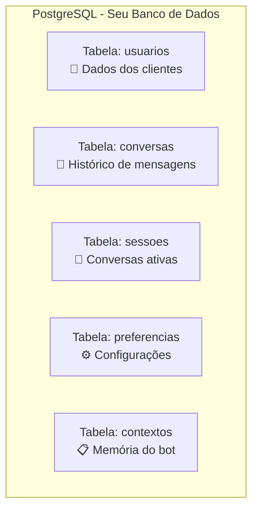
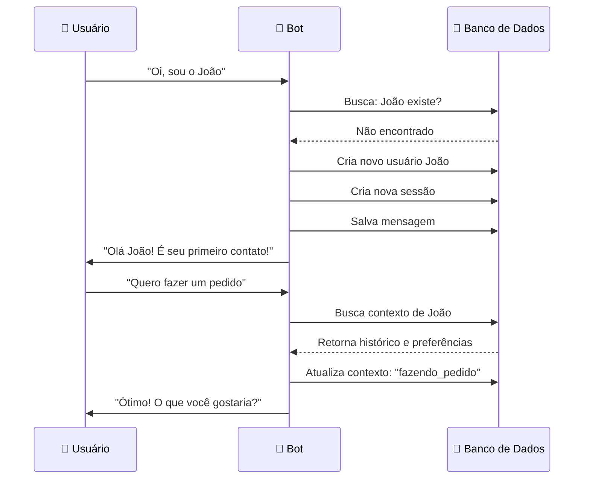
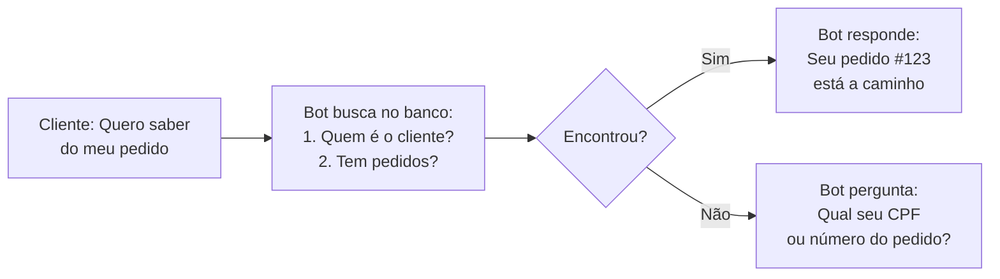

# 🗄️ Context Manager - Guia do Banco de Dados para Iniciantes

## 📌 O que é o Context Manager?

Imagine que você está tendo uma conversa pelo WhatsApp com um amigo. Você lembra do que falaram ontem, conhece o nome dele, sabe suas preferências. O **Context Manager** faz isso para o seu chatbot - ele é a "memória" do sistema.

### Analogia Simples
```
👤 Cliente: "Oi, quero saber sobre meu pedido"
🤖 Bot: "Olá João! Seu pedido #1234 está a caminho"
         ↑                      ↑
    (Lembrou o nome)     (Lembrou o pedido anterior)
```

## 🎯 Para que serve?

O Context Manager guarda 5 tipos principais de informação:

1. **🔄 Estado da Conversa** - Em que ponto da conversa estamos?
2. **📜 Histórico** - O que já foi conversado?
3. **👤 Dados do Usuário** - Quem é a pessoa?
4. **⚙️ Preferências** - Como a pessoa gosta de ser atendida?
5. **📊 Sessão Atual** - Informações temporárias da conversa atual

## 💾 Onde ficam os dados?

### PostgreSQL - Seu "Armário de Arquivos"

PostgreSQL é um banco de dados gratuito e poderoso. Pense nele como um armário super organizado onde cada gaveta guarda um tipo de informação.



## 🏗️ Estrutura Básica (Simplificada)

### 1️⃣ Tabela de Usuários
```sql
-- Esta tabela guarda informações sobre cada pessoa
CREATE TABLE usuarios (
    id            SERIAL PRIMARY KEY,  -- Número único do usuário
    nome          VARCHAR(255),        -- Nome da pessoa
    telefone      VARCHAR(20),         -- Número do WhatsApp
    email         VARCHAR(255),        -- Email (se tiver)
    data_cadastro TIMESTAMP,           -- Quando começou a conversar
    ultima_visita TIMESTAMP            -- Última vez que conversou
);
```

**Exemplo de dados:**
| id | nome | telefone | email | data_cadastro |
|----|------|----------|-------|---------------|
| 1 | João Silva | +5511999999999 | joao@email.com | 2024-01-15 10:00 |
| 2 | Maria Santos | +5511888888888 | maria@email.com | 2024-01-16 14:30 |

### 2️⃣ Tabela de Conversas
```sql
-- Esta tabela guarda cada mensagem trocada
CREATE TABLE conversas (
    id             SERIAL PRIMARY KEY,  -- Número da mensagem
    usuario_id     INTEGER,            -- Quem enviou
    mensagem       TEXT,               -- O que foi dito
    tipo           VARCHAR(50),        -- 'usuario' ou 'bot'
    data_hora      TIMESTAMP,          -- Quando foi enviado
    session_id     VARCHAR(100)        -- Conversa que pertence
);
```

**Exemplo de dados:**
| id | usuario_id | mensagem | tipo | data_hora |
|----|------------|----------|------|-----------|
| 1 | 1 | Oi, preciso de ajuda | usuario | 2024-01-20 09:00 |
| 2 | 1 | Olá João! Como posso ajudar? | bot | 2024-01-20 09:00 |
| 3 | 1 | Quero ver meus pedidos | usuario | 2024-01-20 09:01 |

### 3️⃣ Tabela de Sessões
```sql
-- Esta tabela guarda conversas em andamento
CREATE TABLE sessoes (
    id             VARCHAR(100) PRIMARY KEY,  -- ID único da conversa
    usuario_id     INTEGER,                   -- Pessoa conversando
    status         VARCHAR(50),               -- 'ativa', 'pausada', 'finalizada'
    contexto_atual JSON,                      -- O que está acontecendo agora
    inicio         TIMESTAMP,                 -- Quando começou
    ultima_acao    TIMESTAMP                  -- Última interação
);
```

## 🔄 Como Funciona na Prática?

### Fluxo de uma Conversa



## 📝 Campos Essenciais para o Context Manager

### Informações Mínimas Necessárias

```yaml
USUÁRIO:
  - id: Identificador único
  - nome: Nome da pessoa
  - canal: WhatsApp/Telegram/etc
  - identificador_canal: Número ou ID no canal

SESSÃO:
  - session_id: ID da conversa atual
  - usuario_id: Quem está conversando
  - estado_atual: Em que parte do fluxo está
  - dados_temporarios: Informações desta conversa

CONTEXTO:
  - intencao_atual: O que o usuário quer
  - proxima_acao: O que o bot deve fazer
  - variaveis: Dados coletados (nome, email, etc)
  - timestamp: Quando aconteceu
```

## 🚀 Como Configurar (Passo a Passo Simples)

### 1. Instalar PostgreSQL
```bash
# No Windows: Baixe o instalador em postgresql.org
# No Linux Ubuntu/Debian:
sudo apt update
sudo apt install postgresql postgresql-contrib

# No Mac:
brew install postgresql
```

### 2. Criar o Banco de Dados
```sql
-- Conecte ao PostgreSQL
psql -U postgres

-- Crie o banco
CREATE DATABASE zion_chatbot;

-- Entre no banco
\c zion_chatbot;
```

### 3. Criar as Tabelas Básicas
```sql
-- Copie e cole este código no PostgreSQL

-- Tabela de usuários
CREATE TABLE IF NOT EXISTS usuarios (
    id SERIAL PRIMARY KEY,
    nome VARCHAR(255),
    telefone VARCHAR(20) UNIQUE,
    criado_em TIMESTAMP DEFAULT CURRENT_TIMESTAMP
);

-- Tabela de sessões
CREATE TABLE IF NOT EXISTS sessoes (
    id VARCHAR(100) PRIMARY KEY,
    usuario_id INTEGER REFERENCES usuarios(id),
    status VARCHAR(50) DEFAULT 'ativa',
    contexto JSONB,
    criado_em TIMESTAMP DEFAULT CURRENT_TIMESTAMP,
    atualizado_em TIMESTAMP DEFAULT CURRENT_TIMESTAMP
);

-- Tabela de mensagens
CREATE TABLE IF NOT EXISTS mensagens (
    id SERIAL PRIMARY KEY,
    sessao_id VARCHAR(100) REFERENCES sessoes(id),
    usuario_id INTEGER REFERENCES usuarios(id),
    conteudo TEXT,
    tipo VARCHAR(50),
    criado_em TIMESTAMP DEFAULT CURRENT_TIMESTAMP
);
```

## 🔗 Conectando n8n ao PostgreSQL

### No n8n, siga estes passos:

1. **Adicione as credenciais do PostgreSQL:**
   ```
   Host: localhost (ou IP do servidor)
   Database: zion_chatbot
   User: postgres
   Password: sua_senha
   Port: 5432
   ```

2. **Use o node PostgreSQL para:**
   - **SELECT**: Buscar informações
   - **INSERT**: Adicionar novos dados
   - **UPDATE**: Atualizar informações
   - **DELETE**: Remover dados

### Exemplo de Query no n8n:

**Buscar usuário pelo telefone:**
```sql
SELECT * FROM usuarios
WHERE telefone = '{{$json["telefone"]}}'
LIMIT 1;
```

**Criar nova sessão:**
```sql
INSERT INTO sessoes (id, usuario_id, contexto)
VALUES (
    '{{$json["session_id"]}}',
    {{$json["usuario_id"]}},
    '{{$json["contexto"]}}'::jsonb
);
```

## 💡 Dicas para Iniciantes

### ✅ Faça:
- **Sempre salve o contexto** após cada interação
- **Use IDs únicos** para sessões (UUID)
- **Faça backup** regularmente dos dados
- **Teste primeiro** com poucos dados

### ❌ Evite:
- Guardar senhas sem criptografia
- Deletar dados sem backup
- Fazer queries muito complexas no início
- Esquecer de atualizar o timestamp

## 📊 Exemplo Prático Completo

### Cenário: Cliente pergunta sobre pedido



### Dados no Banco:
```sql
-- O que está guardado
usuarios: {id: 1, nome: "João", telefone: "+5511999999999"}
sessoes: {id: "abc-123", usuario_id: 1, contexto: {"tem_pedido": true}}
pedidos: {id: 123, usuario_id: 1, status: "enviado"}
```

## 🆘 Troubleshooting (Problemas Comuns)

### Problema 1: "Não conecta ao banco"
**Solução:** Verifique se PostgreSQL está rodando
```bash
# Linux/Mac
sudo service postgresql status

# Windows
# Verifique nos Serviços do Windows
```

### Problema 2: "Bot não lembra do contexto"
**Solução:** Verifique se está salvando após cada mensagem
```sql
UPDATE sessoes
SET contexto = '{"novo": "contexto"}'::jsonb
WHERE id = 'session_123';
```

### Problema 3: "Sessões não expiram"
**Solução:** Crie uma rotina para limpar sessões antigas
```sql
UPDATE sessoes
SET status = 'expirada'
WHERE ultima_acao < NOW() - INTERVAL '30 minutes'
AND status = 'ativa';
```

## 📚 Próximos Passos

1. **Pratique com dados simples** primeiro
2. **Aprenda sobre JSONB** no PostgreSQL (ótimo para contextos)
3. **Implemente cache** com Redis para acelerar
4. **Adicione índices** nas colunas mais buscadas
5. **Configure backups automáticos**

---

## 🎓 Resumo para Memorizar

```
📦 Context Manager = Memória do Bot
💾 PostgreSQL = Onde guarda tudo
📋 Tabelas = Organização dos dados
🔄 Sessão = Conversa acontecendo agora
📜 Histórico = Conversas passadas
👤 Usuário = Quem está conversando
```

---

*Guia do Context Manager - Protocolo ZION v3.0*
*Feito para iniciantes em bancos de dados*