# 🔒 QUALITY GATES - ESPECIFICAÇÃO COMPLETA
## Protocolo ZION - Step 7 (CONFIRMA)

> **Versão:** 1.0.0
> **Status:** Specification
> **Última Atualização:** Dezembro 2024
> **Autor:** VALIDATION FORTRESS SQUAD

---

## 🎯 VISÃO GERAL

Esta especificação define critérios objetivos, métricas quantitativas e thresholds para **Quality Gates** obrigatórios em cada passo do Octógono Zion, com foco especial no **Passo 7 (CONFIRMA)**.

### Problema Resolvido

- ❌ **ANTES**: "quality gates" vago e interpretativo
- ✅ **DEPOIS**: Métricas objetivas, thresholds numéricos, validação automática

### Arquitetura de Quality Gates

```mermaid
graph TB
    subgraph "VALIDATION FORTRESS"
        QG1[Octógono Quality Gates<br/>Passos 1-8]
        QG2[Cross-Passo Gates<br/>End-to-End]
        QG3[Business Gates<br/>SLA & Compliance]
        QG4[Security Gates<br/>LGPD & Auth]
    end

    subgraph "COMPLIANCE LEVELS"
        L1[Bronze<br/>Básico]
        L2[Silver<br/>Intermediário]
        L3[Gold<br/>Avançado]
    end

    QG1 --> L1
    QG2 --> L2
    QG3 --> L3
    QG4 --> L3

    style QG1 fill:#3498DB
    style QG2 fill:#9B59B6
    style QG3 fill:#E67E22
    style QG4 fill:#E74C3C
```



---

## 📊 QUALITY GATES POR PASSO DO OCTÓGONO

### Passo 1: RECEBE 🟩

```yaml
Métricas Obrigatórias:
  - latencia_recebimento:
      threshold: 500ms
      unidade: ms
      criticidade: critical
      formula: timestamp_fim - timestamp_inicio

  - taxa_dados_validos:
      threshold: 95%
      unidade: percentage
      criticidade: high
      formula: (mensagens_validas / total_mensagens) * 100

  - throughput_entrada:
      threshold: 100 msg/min
      unidade: count/minute
      criticidade: medium
      formula: mensagens_processadas / tempo_minuto

Quality Checks:
  - webhook_connectivity:
      metodo: health_check_endpoint()
      falha: retry_with_exponential_backoff
      timeout: 10s

  - schema_inicial:
      metodo: validate_json_schema(input)
      falha: reject_with_error_code("SUP-VAL-001")
      required_fields: ["message", "from", "timestamp"]

  - rate_limiting:
      metodo: check_rate_limit(sender_id)
      falha: queue_message_with_delay
      max_per_minute: 20

SLA:
  - Latência máxima: 500ms
  - Taxa de erro máxima: 5%
  - Disponibilidade mínima: 99.9%
```

### Passo 2: RASTREIA 🟨

```yaml
Métricas Obrigatórias:
  - tempo_geracao_ids:
      threshold: 50ms
      unidade: ms
      criticidade: medium
      formula: tempo_fim_geracao - tempo_inicio_geracao

  - completude_metadados:
      threshold: 100%
      unidade: percentage
      criticidade: critical
      formula: (campos_preenchidos / campos_obrigatorios) * 100

  - unicidade_trace_id:
      threshold: 100%
      unidade: percentage
      criticidade: critical
      formula: trace_ids_unicos / total_trace_ids * 100

Quality Checks:
  - formato_uuids:
      metodo: validate_uuid_v4_format(trace_id, correlation_id)
      falha: regenerate_ids()
      pattern: "^[0-9a-f]{8}-[0-9a-f]{4}-4[0-9a-f]{3}-[89ab][0-9a-f]{3}-[0-9a-f]{12}$"

  - timestamp_consistencia:
      metodo: validate_timestamp_sequence()
      falha: adjust_timestamp_to_server_time()
      tolerance_ms: 1000

  - persistencia_telemetria:
      metodo: verify_telemetry_storage()
      falha: fallback_to_local_storage()
      required_fields: ["trace_id", "correlation_id", "timestamp", "payload_hash"]

SLA:
  - Latência máxima: 100ms
  - Taxa de erro máxima: 1%
  - Disponibilidade mínima: 99.95%
```

### Passo 3: VALIDA 🟧

```yaml
Métricas Obrigatórias:
  - tempo_validacao:
      threshold: 200ms
      unidade: ms
      criticidade: high
      formula: tempo_fim_validacao - tempo_inicio_validacao

  - taxa_aprovacao:
      threshold: 80%
      unidade: percentage
      criticidade: medium
      formula: (mensagens_aprovadas / total_mensagens) * 100

  - cobertura_regras:
      threshold: 100%
      unidade: percentage
      criticidade: critical
      formula: (regras_executadas / total_regras_ativas) * 100

Quality Checks:
  - validacao_schema:
      metodo: validate_against_json_schema(data, schema_version)
      falha: return_validation_error_details()
      required: true

  - sanitizacao_dados:
      metodo: sanitize_input_data(payload)
      falha: reject_unsafe_content()
      checks: ["sql_injection", "xss", "script_tags", "malicious_urls"]

  - permissoes_usuario:
      metodo: check_user_permissions(user_id, action_required)
      falha: return_unauthorized_error()
      cache_ttl: 300s

SLA:
  - Latência máxima: 300ms
  - Taxa de erro máxima: 15%
  - Disponibilidade mínima: 99.5%
```

### Passo 4: ROTEIA 🟪

```yaml
Métricas Obrigatórias:
  - tempo_decisao_rota:
      threshold: 150ms
      unidade: ms
      criticidade: medium
      formula: tempo_decisao - tempo_inicio_analise

  - precisao_roteamento:
      threshold: 90%
      unidade: percentage
      criticidade: high
      formula: (rotas_corretas / total_rotas) * 100

  - distribuicao_carga:
      threshold: 15%
      unidade: percentage_deviation
      criticidade: medium
      formula: std_deviation(carga_por_agente) / media_carga * 100

Quality Checks:
  - disponibilidade_agentes:
      metodo: check_agent_availability()
      falha: route_to_overflow_queue()
      min_agents_available: 1

  - capacidade_processamento:
      metodo: verify_processing_capacity()
      falha: implement_circuit_breaker()
      max_queue_size: 100

  - regras_roteamento:
      metodo: validate_routing_rules(criteria)
      falha: apply_default_routing()
      required_criteria: ["priority", "type", "user_segment"]

SLA:
  - Latência máxima: 200ms
  - Taxa de erro máxima: 8%
  - Disponibilidade mínima: 99.8%
```

### Passo 5: PROCESSA 🟦

```yaml
Métricas Obrigatórias:
  - tempo_processamento:
      threshold: 5000ms
      unidade: ms
      criticidade: critical
      formula: tempo_fim_processamento - tempo_inicio_processamento

  - qualidade_resposta_ia:
      threshold: 0.8
      unidade: score_0_to_1
      criticidade: high
      formula: ai_confidence_score * relevance_score

  - taxa_sucesso_apis:
      threshold: 95%
      unidade: percentage
      criticidade: critical
      formula: (chamadas_api_sucesso / total_chamadas_api) * 100

Quality Checks:
  - timeout_processamento:
      metodo: enforce_processing_timeout()
      falha: return_partial_result_or_error()
      max_duration: 30s

  - validacao_resposta_ia:
      metodo: validate_ai_response_quality(response)
      falha: request_human_review()
      min_confidence: 0.7

  - integridade_dados:
      metodo: verify_data_integrity_post_processing()
      falha: rollback_to_previous_state()
      checks: ["data_consistency", "format_validation", "business_rules"]

SLA:
  - Latência máxima: 10s
  - Taxa de erro máxima: 10%
  - Disponibilidade mínima: 99.0%
```

### Passo 6: AGREGA 🟨

```yaml
Métricas Obrigatórias:
  - tempo_agregacao:
      threshold: 300ms
      unidade: ms
      criticidade: medium
      formula: tempo_fim_merge - tempo_inicio_merge

  - completude_dados:
      threshold: 95%
      unidade: percentage
      criticidade: high
      formula: (dados_agregados_completos / total_fontes) * 100

  - consistencia_merge:
      threshold: 98%
      unidade: percentage
      criticidade: critical
      formula: (registros_consistentes / total_registros) * 100

Quality Checks:
  - conflitos_dados:
      metodo: detect_and_resolve_data_conflicts()
      falha: apply_conflict_resolution_strategy()
      strategies: ["timestamp_priority", "source_weight", "manual_review"]

  - validacao_merge:
      metodo: validate_merged_data_structure()
      falha: retry_merge_with_different_strategy()
      required_fields: ["id", "timestamp", "source", "data"]

  - performance_agregacao:
      metodo: monitor_aggregation_performance()
      falha: optimize_aggregation_strategy()
      max_memory_usage: "512MB"

SLA:
  - Latência máxima: 500ms
  - Taxa de erro máxima: 5%
  - Disponibilidade mínima: 99.5%
```

### **Passo 7: CONFIRMA 🟧 (QUALITY GATES FINAIS)**

```yaml
Métricas Obrigatórias:
  - tempo_quality_gates:
      threshold: 400ms
      unidade: ms
      criticidade: critical
      formula: tempo_fim_validacao - tempo_inicio_gates

  - score_qualidade_geral:
      threshold: 0.85
      unidade: score_0_to_1
      criticidade: critical
      formula: weighted_average(all_quality_metrics)

  - conformidade_compliance:
      threshold: 100%
      unidade: percentage
      criticidade: critical
      formula: (regras_compliance_ok / total_regras_compliance) * 100

  - seguranca_dados:
      threshold: 100%
      unidade: percentage
      criticidade: critical
      formula: (verificacoes_seguranca_ok / total_verificacoes) * 100

Quality Checks:
  - validacao_resposta_final:
      metodo: comprehensive_response_validation()
      falha: block_delivery_and_alert()
      checks:
        - content_safety: true
        - business_rules: true
        - format_compliance: true
        - data_privacy: true

  - auditoria_lgpd:
      metodo: validate_lgpd_compliance()
      falha: anonymize_or_block_response()
      checks:
        - personal_data_exposure: false
        - consent_verification: true
        - data_minimization: true
        - purpose_limitation: true

  - aprovacao_negocio:
      metodo: business_approval_gates()
      falha: escalate_to_human_review()
      gates:
        - financial_limit_check: true
        - brand_safety_check: true
        - legal_compliance_check: true
        - customer_satisfaction_prediction: ">= 0.8"

Quality Gates Específicos:
  - gate_conteudo_seguro:
      description: "Verifica se o conteúdo é seguro para envio"
      threshold: 100%
      validation: no_harmful_content(response)
      action_on_fail: block_and_review

  - gate_precisao_resposta:
      description: "Verifica precisão da resposta gerada"
      threshold: 0.85
      validation: accuracy_score >= 0.85
      action_on_fail: regenerate_or_human_review

  - gate_tempo_resposta_sla:
      description: "Verifica se SLA de tempo foi atendido"
      threshold: 5000ms
      validation: total_processing_time <= sla_limit
      action_on_fail: send_timeout_response

  - gate_dados_pessoais:
      description: "Verifica exposição de dados pessoais"
      threshold: 0%
      validation: no_personal_data_exposed(response)
      action_on_fail: sanitize_and_retry

SLA:
  - Latência máxima: 500ms
  - Taxa de erro máxima: 2%
  - Disponibilidade mínima: 99.9%
```

### Passo 8: ENTREGA 🟩

```yaml
Métricas Obrigatórias:
  - tempo_entrega:
      threshold: 1000ms
      unidade: ms
      criticidade: high
      formula: tempo_entrega_confirmada - tempo_inicio_entrega

  - taxa_entrega_sucesso:
      threshold: 98%
      unidade: percentage
      criticidade: critical
      formula: (entregas_confirmadas / total_tentativas) * 100

  - satisfacao_usuario:
      threshold: 4.0
      unidade: score_1_to_5
      criticidade: medium
      formula: media_avaliacoes_ultimos_30_dias

Quality Checks:
  - confirmacao_entrega:
      metodo: verify_delivery_confirmation()
      falha: retry_delivery_or_alert()
      max_retries: 3

  - formato_resposta:
      metodo: validate_response_format()
      falha: reformat_and_retry()
      required_fields: ["message", "timestamp", "status"]

  - fechamento_contexto:
      metodo: properly_close_conversation_context()
      falha: log_context_closure_error()
      update_session_state: true

SLA:
  - Latência máxima: 2s
  - Taxa de erro máxima: 3%
  - Disponibilidade mínima: 99.8%
```

---

## 🏆 MATRIZ DE COMPLIANCE

### Compliance Level 1: BRONZE (Básico)

```yaml
Requisitos Mínimos:
  - Implementação dos 8 passos do Octógono obrigatórios
  - Quality gates básicos nos Passos 3, 7, 8
  - Logging estruturado em todos os passos
  - Tratamento de erro em passos críticos
  - Métricas de latência e taxa de erro

Métricas Essenciais:
  - Latência média por passo: < 1s
  - Taxa de erro geral: < 10%
  - Disponibilidade: > 99%
  - Cobertura de logs: 100%

Validação Bronze:
  - [ ] Todos os 8 passos do Octógono implementados
  - [ ] Quality gates básicos funcionando
  - [ ] Logs estruturados presentes
  - [ ] Error handling configurado
  - [ ] Métricas básicas coletadas

Certificação: Automática via validador
```

### Compliance Level 2: SILVER (Intermediário)

```yaml
Requisitos (Bronze +):
  - Observabilidade completa (traces, metrics, logs)
  - Quality gates avançados em todos os passos
  - Alertas configurados para SLA
  - Dashboards de monitoramento
  - Testes automatizados end-to-end

Métricas Adicionais:
  - Score de qualidade médio: > 0.8
  - Tempo médio de resolução: < 5min
  - Cobertura de testes: > 80%
  - Alertas configurados: 100%
  - MTTR (Mean Time to Recovery): < 15min

Observabilidade Completa:
  - Distributed tracing funcionando
  - Custom metrics por domínio
  - Real-time dashboards
  - Proactive alerting
  - Performance baselines

Validação Silver:
  - [ ] Todas validações Bronze +
  - [ ] Observabilidade 360° configurada
  - [ ] Alertas proativos funcionando
  - [ ] Dashboards operacionais
  - [ ] Testes E2E automatizados

Certificação: Review + validação automática
```

### Compliance Level 3: GOLD (Avançado)

```yaml
Requisitos (Silver +):
  - Security hardening completo
  - Compliance LGPD/GDPR automático
  - Disaster recovery configurado
  - Chaos engineering implementado
  - Machine learning para otimização

Métricas Avançadas:
  - Security score: 100%
  - LGPD compliance: 100%
  - RTO (Recovery Time Objective): < 5min
  - RPO (Recovery Point Objective): < 1min
  - Chaos resilience score: > 90%

Security Hardening:
  - Encryption em repouso e trânsito
  - Access control granular
  - Audit trail completo
  - Vulnerability scanning automático
  - Penetration testing regular

Compliance Automático:
  - Data classification automática
  - Consent management integrado
  - Data retention policies
  - Right to erasure implementation
  - Privacy by design validation

Validação Gold:
  - [ ] Todas validações Silver +
  - [ ] Security audit aprovado
  - [ ] LGPD compliance verificado
  - [ ] DR testado e funcional
  - [ ] Chaos engineering validado

Certificação: Auditoria externa + review técnico
```

---

## 🤖 SCRIPTS DE VALIDAÇÃO AUTOMÁTICA

### Validador Principal

```javascript
// quality-gates-validator.js

class QualityGatesValidator {
  constructor(config) {
    this.config = config;
    this.thresholds = config.thresholds;
    this.metrics = new MetricsCollector();
  }

  // Validação Passo 1: RECEBE
  async validateStep1(data) {
    const startTime = Date.now();
    const checks = {
      latencia_recebimento: this.validateLatency(data.processing_time, 500),
      taxa_dados_validos: this.validateDataValidityRate(data.valid_messages, data.total_messages, 0.95),
      throughput_entrada: this.validateThroughput(data.messages_per_minute, 100),
      webhook_connectivity: await this.checkWebhookHealth(),
      schema_inicial: this.validateInitialSchema(data.payload),
      rate_limiting: this.checkRateLimit(data.sender_id)
    };

    return this.generateStepResult("1.REC", checks, startTime);
  }

  // Validação Passo 2: RASTREIA
  async validateStep2(data) {
    const startTime = Date.now();
    const checks = {
      tempo_geracao_ids: this.validateLatency(data.id_generation_time, 50),
      completude_metadados: this.validateMetadataCompleteness(data.metadata, 1.0),
      unicidade_trace_id: await this.validateTraceIdUniqueness(data.trace_id),
      formato_uuids: this.validateUUIDFormat(data.trace_id, data.correlation_id),
      timestamp_consistencia: this.validateTimestampConsistency(data.timestamps),
      persistencia_telemetria: await this.verifyTelemetryStorage(data.telemetry)
    };

    return this.generateStepResult("2.RAS", checks, startTime);
  }

  // Validação Passo 3: VALIDA
  async validateStep3(data) {
    const startTime = Date.now();
    const checks = {
      tempo_validacao: this.validateLatency(data.validation_time, 200),
      taxa_aprovacao: this.validateApprovalRate(data.approved, data.total, 0.8),
      cobertura_regras: this.validateRuleCoverage(data.rules_executed, data.total_rules, 1.0),
      validacao_schema: this.validateSchema(data.payload, data.schema_version),
      sanitizacao_dados: this.validateDataSanitization(data.payload),
      permissoes_usuario: await this.checkUserPermissions(data.user_id, data.action)
    };

    return this.generateStepResult("3.VAL", checks, startTime);
  }

  // Validação Passo 4: ROTEIA
  async validateStep4(data) {
    const startTime = Date.now();
    const checks = {
      tempo_decisao_rota: this.validateLatency(data.routing_decision_time, 150),
      precisao_roteamento: this.validateRoutingAccuracy(data.correct_routes, data.total_routes, 0.9),
      distribuicao_carga: this.validateLoadDistribution(data.agent_loads, 0.15),
      disponibilidade_agentes: await this.checkAgentAvailability(),
      capacidade_processamento: this.verifyProcessingCapacity(data.queue_size, 100),
      regras_roteamento: this.validateRoutingRules(data.routing_criteria)
    };

    return this.generateStepResult("4.ROT", checks, startTime);
  }

  // Validação Passo 5: PROCESSA
  async validateStep5(data) {
    const startTime = Date.now();
    const checks = {
      tempo_processamento: this.validateLatency(data.processing_time, 5000),
      qualidade_resposta_ia: this.validateAIResponseQuality(data.ai_response, 0.8),
      taxa_sucesso_apis: this.validateAPISuccessRate(data.api_calls, 0.95),
      timeout_processamento: this.enforceProcessingTimeout(data.duration, 30000),
      validacao_resposta_ia: this.validateAIResponse(data.ai_response, 0.7),
      integridade_dados: this.verifyDataIntegrity(data.processed_data)
    };

    return this.generateStepResult("5.PRO", checks, startTime);
  }

  // Validação Passo 6: AGREGA
  async validateStep6(data) {
    const startTime = Date.now();
    const checks = {
      tempo_agregacao: this.validateLatency(data.aggregation_time, 300),
      completude_dados: this.validateDataCompleteness(data.aggregated_data, data.sources, 0.95),
      consistencia_merge: this.validateMergeConsistency(data.merged_records, 0.98),
      conflitos_dados: this.detectDataConflicts(data.data_sources),
      validacao_merge: this.validateMergedStructure(data.merged_data),
      performance_agregacao: this.monitorAggregationPerformance(data.memory_usage, "512MB")
    };

    return this.generateStepResult("6.AGR", checks, startTime);
  }

  // Validação Passo 7: CONFIRMA (CRITICAL)
  async validateStep7(data) {
    const startTime = Date.now();
    const checks = {
      tempo_quality_gates: this.validateLatency(data.gates_processing_time, 400),
      score_qualidade_geral: this.validateOverallQualityScore(data.quality_metrics, 0.85),
      conformidade_compliance: this.validateComplianceConformity(data.compliance_checks, 1.0),
      seguranca_dados: this.validateDataSecurity(data.security_checks, 1.0),

      // Quality Gates Específicos
      gate_conteudo_seguro: this.validateContentSafety(data.response),
      gate_precisao_resposta: this.validateResponseAccuracy(data.response, 0.85),
      gate_tempo_resposta_sla: this.validateSLACompliance(data.total_processing_time, data.sla_limit),
      gate_dados_pessoais: this.validatePersonalDataExposure(data.response),

      // Compliance específico
      auditoria_lgpd: await this.validateLGPDCompliance(data),
      aprovacao_negocio: await this.businessApprovalGates(data)
    };

    const result = this.generateStepResult("7.CON", checks, startTime);

    // Passo 7 é crítico - falha bloqueia entrega
    if (!result.passed) {
      await this.blockDeliveryAndAlert(data, result);
    }

    return result;
  }

  // Validação Passo 8: ENTREGA
  async validateStep8(data) {
    const startTime = Date.now();
    const checks = {
      tempo_entrega: this.validateLatency(data.delivery_time, 1000),
      taxa_entrega_sucesso: this.validateDeliverySuccessRate(data.confirmed_deliveries, data.attempts, 0.98),
      satisfacao_usuario: this.validateUserSatisfaction(data.satisfaction_score, 4.0),
      confirmacao_entrega: await this.verifyDeliveryConfirmation(data.delivery_id),
      formato_resposta: this.validateResponseFormat(data.response),
      fechamento_contexto: this.properlyCloseContext(data.session_id)
    };

    return this.generateStepResult("8.ENT", checks, startTime);
  }

  // Métodos auxiliares de validação
  validateLatency(actualTime, threshold) {
    return {
      passed: actualTime <= threshold,
      actual: actualTime,
      threshold: threshold,
      unit: "ms",
      criticality: actualTime > threshold * 1.5 ? "critical" : "medium"
    };
  }

  validateDataValidityRate(validCount, totalCount, threshold) {
    const rate = validCount / totalCount;
    return {
      passed: rate >= threshold,
      actual: rate,
      threshold: threshold,
      unit: "percentage",
      criticality: rate < threshold * 0.8 ? "critical" : "medium"
    };
  }

  async validateLGPDCompliance(data) {
    const checks = {
      personal_data_exposure: this.checkPersonalDataExposure(data.response),
      consent_verification: await this.verifyConsent(data.user_id),
      data_minimization: this.checkDataMinimization(data.processed_data),
      purpose_limitation: this.checkPurposeLimitation(data.processing_purpose)
    };

    return {
      passed: Object.values(checks).every(check => check.passed),
      details: checks
    };
  }

  async businessApprovalGates(data) {
    const gates = {
      financial_limit_check: this.checkFinancialLimits(data.financial_impact),
      brand_safety_check: this.checkBrandSafety(data.response),
      legal_compliance_check: await this.checkLegalCompliance(data),
      customer_satisfaction_prediction: this.predictCustomerSatisfaction(data.response)
    };

    return {
      passed: Object.values(gates).every(gate => gate.passed),
      details: gates
    };
  }

  generateStepResult(stepName, checks, startTime) {
    const duration = Date.now() - startTime;
    const passedChecks = Object.values(checks).filter(check => check.passed).length;
    const totalChecks = Object.keys(checks).length;
    const score = passedChecks / totalChecks;

    return {
      step: stepName,
      passed: score >= 0.8, // 80% dos checks devem passar
      score: score,
      duration: duration,
      checks: checks,
      summary: {
        total_checks: totalChecks,
        passed_checks: passedChecks,
        failed_checks: totalChecks - passedChecks
      },
      timestamp: new Date().toISOString()
    };
  }

  async blockDeliveryAndAlert(data, result) {
    // Bloqueia entrega
    await this.blockDelivery(data.session_id, result);

    // Envia alertas
    await this.sendAlert({
      level: "CRITICAL",
      message: "Step 7 quality gates failed - delivery blocked",
      details: result,
      trace_id: data.trace_id
    });

    // Log estruturado
    this.logger.error("[QUALITY-GATE-FAILURE]", {
      step: "7.CON",
      trace_id: data.trace_id,
      failed_checks: result.checks,
      score: result.score
    });
  }
}

// Exemplo de uso
const validator = new QualityGatesValidator(config);

// Validar step específico
const step7Result = await validator.validateStep7(stepData);

if (!step7Result.passed) {
  console.error("Quality gates falharam:", step7Result.summary);
}
```

### Validador de Compliance

```javascript
// compliance-validator.js

class ComplianceValidator {
  async validateBronzeCompliance(workflow) {
    const checks = {
      octogono_steps_implemented: this.validateOctogonoStepsPresent(workflow),
      basic_quality_gates: this.validateBasicQualityGates(workflow),
      structured_logging: this.validateStructuredLogging(workflow),
      error_handling: this.validateErrorHandling(workflow),
      basic_metrics: this.validateBasicMetrics(workflow)
    };

    return {
      level: "BRONZE",
      passed: Object.values(checks).every(check => check.passed),
      score: this.calculateComplianceScore(checks),
      checks: checks,
      certification: this.generateCertification("BRONZE", checks)
    };
  }

  async validateSilverCompliance(workflow) {
    const bronzeResult = await this.validateBronzeCompliance(workflow);

    if (!bronzeResult.passed) {
      return { level: "SILVER", passed: false, reason: "Bronze compliance required" };
    }

    const silverChecks = {
      observability_complete: this.validateCompleteObservability(workflow),
      advanced_quality_gates: this.validateAdvancedQualityGates(workflow),
      proactive_alerts: this.validateProactiveAlerts(workflow),
      operational_dashboards: this.validateOperationalDashboards(workflow),
      automated_e2e_tests: this.validateAutomatedE2ETests(workflow)
    };

    return {
      level: "SILVER",
      passed: Object.values(silverChecks).every(check => check.passed),
      score: this.calculateComplianceScore(silverChecks),
      checks: { ...bronzeResult.checks, ...silverChecks },
      certification: this.generateCertification("SILVER", silverChecks)
    };
  }

  async validateGoldCompliance(workflow) {
    const silverResult = await this.validateSilverCompliance(workflow);

    if (!silverResult.passed) {
      return { level: "GOLD", passed: false, reason: "Silver compliance required" };
    }

    const goldChecks = {
      security_hardening: this.validateSecurityHardening(workflow),
      lgpd_compliance: await this.validateLGPDCompliance(workflow),
      disaster_recovery: this.validateDisasterRecovery(workflow),
      chaos_engineering: this.validateChaosEngineering(workflow),
      ml_optimization: this.validateMLOptimization(workflow)
    };

    return {
      level: "GOLD",
      passed: Object.values(goldChecks).every(check => check.passed),
      score: this.calculateComplianceScore(goldChecks),
      checks: { ...silverResult.checks, ...goldChecks },
      certification: this.generateCertification("GOLD", goldChecks)
    };
  }
}
```

---

## 📊 DASHBOARDS E ALERTAS

### Dashboard Principal - Quality Gates

```yaml
Dashboard: "ZION Quality Gates Overview"
Refresh: 30s
Time Range: Last 24h

Panels:
  1. Quality Score por Step:
     - Metric: avg(quality_score) by step
     - Type: Time series
     - Threshold: Red < 0.7, Yellow < 0.85, Green >= 0.85

  2. Latência por Step:
     - Metric: p95(latency_ms) by step
     - Type: Heatmap
     - Threshold: Red > SLA * 1.2, Yellow > SLA, Green <= SLA

  3. Taxa de Erro por Step:
     - Metric: error_rate by step
     - Type: Stat panel
     - Threshold: Red > 10%, Yellow > 5%, Green <= 5%

  4. Compliance Level Distribution:
     - Metric: count(workflows) by compliance_level
     - Type: Pie chart

  5. Quality Gates Failures:
     - Metric: sum(quality_gate_failures) by gate_type
     - Type: Bar chart
     - Alert: Any failure triggers notification

Alerting Rules:
  - Passo 7 Quality Gate Failure:
      condition: quality_gate_passo7_failed > 0
      severity: Critical
      notification: Slack + PagerDuty

  - Overall Quality Score Low:
      condition: avg(overall_quality_score) < 0.8
      severity: Warning
      notification: Slack

  - SLA Breach:
      condition: latency_p95 > sla_threshold
      severity: High
      notification: Email + Slack
```

### Queries de Observabilidade

```sql
-- Quality Score por Passo (PostgreSQL)
SELECT
  passo_name,
  AVG(quality_score) as avg_quality_score,
  COUNT(*) as total_executions,
  COUNT(CASE WHEN quality_score < 0.8 THEN 1 END) as low_quality_executions
FROM quality_metrics
WHERE timestamp >= NOW() - INTERVAL '24 hours'
GROUP BY passo_name
ORDER BY avg_quality_score ASC;

-- Top Quality Gate Failures
SELECT
  gate_name,
  COUNT(*) as failure_count,
  AVG(EXTRACT(EPOCH FROM processing_time)) as avg_processing_time_seconds
FROM quality_gate_failures
WHERE timestamp >= NOW() - INTERVAL '7 days'
GROUP BY gate_name
ORDER BY failure_count DESC
LIMIT 10;

-- Compliance Level Metrics
SELECT
  compliance_level,
  COUNT(*) as workflow_count,
  AVG(compliance_score) as avg_score
FROM workflow_compliance
GROUP BY compliance_level;

-- LGPD Compliance Violations
SELECT
  violation_type,
  COUNT(*) as violation_count,
  workflow_id,
  MAX(timestamp) as last_occurrence
FROM lgpd_violations
WHERE timestamp >= NOW() - INTERVAL '30 days'
GROUP BY violation_type, workflow_id
ORDER BY violation_count DESC;
```

### Alertas Proativos

```yaml
Alert: "Passo7_Quality_Gate_Critical_Failure"
Condition: |
  sum(rate(quality_gate_failures{passo="7.CON",severity="critical"}[5m])) > 0
For: 1m
Severity: Critical
Notifications:
  - PagerDuty: on-call-team
  - Slack: #quality-alerts
  - Email: sre-team@company.com
Message: |
  🚨 CRITICAL: Passo 7 Quality Gate failure detected
  Workflow: {{ $labels.workflow_id }}
  Gate: {{ $labels.gate_name }}
  Trace ID: {{ $labels.trace_id }}

  Immediate action required - delivery blocked.

Alert: "Quality_Score_Degradation"
Condition: |
  avg_over_time(overall_quality_score[30m]) < 0.8
For: 10m
Severity: Warning
Notifications:
  - Slack: #quality-monitoring
Message: |
  ⚠️ Quality score degradation detected
  Current average: {{ $value }}
  Threshold: 0.8

  Review recent deployments and system performance.

Alert: "SLA_Breach_Multiple_Passos"
Condition: |
  count(passo_latency_p95 > passo_sla_threshold) > 2
For: 5m
Severity: High
Notifications:
  - Slack: #performance-alerts
  - Email: performance-team@company.com
Message: |
  🔴 Multiple passos breaching SLA
  Affected passos: {{ range $label, $value := $labels }}{{ $label }} {{ end }}

  System performance degradation detected.
```

---

## ✅ CHECKLIST DE IMPLEMENTAÇÃO

### Implementação Básica (Bronze)

```markdown
## Quality Gates - Checklist Bronze

### Setup Inicial
- [ ] Estrutura de banco para métricas criada
- [ ] Logger estruturado configurado
- [ ] Collector de métricas implementado
- [ ] Validador básico dos 8 passos do Octógono funcionando

### Passo 1: RECEBE
- [ ] Validação de latência (< 500ms)
- [ ] Check de taxa de dados válidos (> 95%)
- [ ] Monitoramento de throughput
- [ ] Health check de webhooks
- [ ] Validação de schema inicial

### Passo 2: RASTREIA
- [ ] Validação de tempo de geração de IDs (< 50ms)
- [ ] Check de completude de metadados (100%)
- [ ] Verificação de unicidade de trace_id
- [ ] Validação de formato UUID
- [ ] Persistência de telemetria

### Passo 3: VALIDA
- [ ] Validação de tempo de processamento (< 200ms)
- [ ] Taxa de aprovação monitorada (> 80%)
- [ ] Cobertura de regras verificada (100%)
- [ ] Schema validation implementada
- [ ] Sanitização de dados funcionando

### Passo 4: ROTEIA
- [ ] Tempo de decisão monitorado (< 150ms)
- [ ] Precisão de roteamento verificada (> 90%)
- [ ] Distribuição de carga balanceada
- [ ] Check de disponibilidade de agentes
- [ ] Validação de regras de roteamento

### Passo 5: PROCESSA
- [ ] Timeout de processamento (< 5s típico, < 30s máximo)
- [ ] Qualidade de resposta IA (> 0.8)
- [ ] Taxa de sucesso de APIs (> 95%)
- [ ] Validação de integridade de dados
- [ ] Circuit breaker para APIs externas

### Passo 6: AGREGA
- [ ] Tempo de agregação monitorado (< 300ms)
- [ ] Completude de dados verificada (> 95%)
- [ ] Consistência de merge validada (> 98%)
- [ ] Detecção de conflitos implementada
- [ ] Performance de agregação otimizada

### Passo 7: CONFIRMA (CRÍTICO)
- [ ] Tempo de quality gates (< 400ms)
- [ ] Score de qualidade geral (> 0.85)
- [ ] Conformidade compliance (100%)
- [ ] Segurança de dados verificada
- [ ] Gate de conteúdo seguro
- [ ] Gate de precisão de resposta
- [ ] Gate de SLA de tempo
- [ ] Gate de dados pessoais
- [ ] Bloqueio automático em falha

### Passo 8: ENTREGA
- [ ] Tempo de entrega monitorado (< 1s)
- [ ] Taxa de sucesso verificada (> 98%)
- [ ] Confirmação de entrega implementada
- [ ] Formato de resposta validado
- [ ] Fechamento de contexto funcionando

### Observabilidade
- [ ] Logs estruturados em todos os passos
- [ ] Métricas coletadas e armazenadas
- [ ] Dashboard básico configurado
- [ ] Alertas críticos funcionando
- [ ] Trace IDs propagados corretamente
```

### Implementação Avançada (Silver)

```markdown
## Quality Gates - Checklist Silver

### Observabilidade Completa
- [ ] Distributed tracing configurado
- [ ] Custom metrics por domínio implementadas
- [ ] Real-time dashboards operacionais
- [ ] Alertas proativos configurados
- [ ] Performance baselines estabelecidos

### Quality Gates Avançados
- [ ] Todos os quality gates Bronze +
- [ ] Machine learning para detecção de anomalias
- [ ] Predição de falhas implementada
- [ ] Auto-remediation para issues comuns
- [ ] Quality scoring dinâmico

### Testes e Validação
- [ ] Testes E2E automatizados
- [ ] Testes de carga para quality gates
- [ ] Validação de cenários de falha
- [ ] Performance benchmarking
- [ ] Chaos engineering básico

### Alertas Inteligentes
- [ ] Alertas baseados em ML
- [ ] Correlation de eventos
- [ ] Auto-escalation configurado
- [ ] Context-aware notifications
- [ ] Fatigue reduction implementado
```

### Implementação Premium (Gold)

```markdown
## Quality Gates - Checklist Gold

### Security Hardening
- [ ] Encryption em repouso e trânsito
- [ ] Access control granular
- [ ] Audit trail completo
- [ ] Vulnerability scanning automático
- [ ] Penetration testing regular

### Compliance Automático
- [ ] Data classification automática
- [ ] Consent management integrado
- [ ] Data retention policies automáticas
- [ ] Right to erasure implementation
- [ ] Privacy by design validation

### Disaster Recovery
- [ ] Backup automático de métricas
- [ ] Recovery procedures testados
- [ ] RTO/RPO targets definidos e validados
- [ ] Cross-region redundancy
- [ ] Business continuity planning

### Advanced Analytics
- [ ] Predictive quality analytics
- [ ] Automated optimization recommendations
- [ ] Business impact correlation
- [ ] Cost optimization insights
- [ ] ROI measurement for quality improvements
```

---

## 🔬 EXEMPLO DE IMPLEMENTAÇÃO COMPLETA

### Workflow de Exemplo: SUP-WA-001

```javascript
// Implementação completa dos Quality Gates para SUP-WA-001
// "Atendimento WhatsApp - Suporte Cliente"

class SuporteWhatsAppQualityGates extends QualityGatesValidator {
  constructor() {
    super({
      workflow_id: "SUP-WA-001",
      sla_response_time: 5000, // 5 segundos
      quality_threshold: 0.85,
      compliance_level: "SILVER"
    });
  }

  async validateStep7Suporte(data) {
    const startTime = Date.now();

    // Quality Gates específicos para suporte
    const supportChecks = {
      // Gates básicos (herdados)
      ...await super.validateStep7(data),

      // Gates específicos do suporte
      gate_resolucao_problema: this.validateProblemResolution(data.response),
      gate_satisfacao_cliente: this.predictCustomerSatisfaction(data.interaction),
      gate_escalacao_necessaria: this.checkEscalationNeeds(data.complexity_score),
      gate_conhecimento_base: this.validateKnowledgeBaseUsage(data.kb_references),
      gate_tempo_primeira_resposta: this.validateFirstResponseTime(data.response_time, 60000) // 1 min
    };

    const result = this.generateStepResult("7.CON", supportChecks, startTime);

    // Lógica específica para suporte
    if (!result.passed) {
      await this.handleSupportQualityFailure(data, result);
    }

    return result;
  }

  validateProblemResolution(response) {
    // Usa NLP para verificar se resposta resolve o problema
    const resolutionScore = this.nlpAnalyzer.analyzeResolution(response);

    return {
      passed: resolutionScore >= 0.8,
      score: resolutionScore,
      threshold: 0.8,
      details: {
        contains_solution: resolutionScore > 0.6,
        is_actionable: this.containsActionableSteps(response),
        is_complete: this.isCompleteResponse(response)
      }
    };
  }

  predictCustomerSatisfaction(interaction) {
    // ML model para prever satisfação
    const features = this.extractInteractionFeatures(interaction);
    const satisfactionPrediction = this.mlModel.predict(features);

    return {
      passed: satisfactionPrediction >= 4.0, // Escala 1-5
      score: satisfactionPrediction,
      threshold: 4.0,
      confidence: this.mlModel.getConfidence(),
      features_used: features
    };
  }

  async handleSupportQualityFailure(data, result) {
    // Actions específicas para falhas de qualidade no suporte

    if (result.checks.gate_satisfacao_cliente?.score < 3.0) {
      // Satisfação muito baixa - escalar para humano
      await this.escalateToHuman(data, "LOW_SATISFACTION_PREDICTED");
    }

    if (result.checks.gate_resolucao_problema?.score < 0.6) {
      // Resposta não resolve problema - tentar regenerar
      await this.regenerateResponseWithContext(data, "PROBLEM_NOT_RESOLVED");
    }

    if (result.checks.gate_tempo_primeira_resposta?.passed === false) {
      // SLA de primeira resposta violado - alertar supervisão
      await this.alertSupervision(data, "FIRST_RESPONSE_SLA_BREACH");
    }
  }
}

// Implementação no workflow n8n
const supportQG = new SuporteWhatsAppQualityGates();

// Node 7.CON:QUALITY_SUPORTE
async function step7QualityGates(inputData) {
  try {
    const qualityResult = await supportQG.validateStep7Suporte(inputData);

    if (!qualityResult.passed) {
      // Bloqueia entrega e registra falha
      await supportQG.blockDeliveryAndAlert(inputData, qualityResult);

      return {
        success: false,
        blocked: true,
        reason: "Quality gates failed",
        quality_result: qualityResult,
        next_action: "human_review_required"
      };
    }

    // Gates passaram - pode prosseguir para Step 8
    return {
      success: true,
      quality_score: qualityResult.score,
      quality_details: qualityResult.checks,
      approved_for_delivery: true
    };

  } catch (error) {
    // Falha no próprio quality gate - escalar imediatamente
    await supportQG.handleQualityGateError(error, inputData);

    return {
      success: false,
      error: "Quality gate system failure",
      fallback_action: "escalate_to_human"
    };
  }
}
```

---

## 📈 MÉTRICAS DE SUCESSO

### KPIs Principais

```yaml
Qualidade:
  - Overall Quality Score: > 0.85
  - Step 7 Gate Success Rate: > 95%
  - False Positive Rate: < 5%
  - False Negative Rate: < 2%

Performance:
  - Quality Gate Latency: < 400ms (p95)
  - End-to-End Processing Time: < 10s (p95)
  - System Availability: > 99.9%
  - MTTR (Mean Time to Recovery): < 15min

Business Impact:
  - Customer Satisfaction: > 4.2/5
  - First Call Resolution: > 80%
  - Escalation Rate: < 15%
  - Compliance Violations: 0

Operational:
  - Alert Fatigue Score: < 20%
  - Manual Intervention Rate: < 5%
  - Automated Resolution Rate: > 90%
  - Cost per Quality Check: < $0.01
```

### Métricas por Compliance Level

```yaml
Bronze Level:
  - Basic Quality Gates Coverage: 100%
  - Error Rate: < 10%
  - Logging Coverage: 100%
  - Alert Response Time: < 30min

Silver Level:
  - Advanced Quality Gates Coverage: 100%
  - Error Rate: < 5%
  - Observability Score: > 0.9
  - MTTR: < 15min
  - Automated Test Coverage: > 80%

Gold Level:
  - Error Rate: < 2%
  - Security Score: 100%
  - LGPD Compliance: 100%
  - Chaos Resilience: > 90%
  - Business Continuity Score: > 95%
```

---

## 🎯 CONCLUSÃO

Esta especificação estabelece o framework definitivo para **Quality Gates** no Zion Protocol, transformando o Passo 7 (CONFIRMA) de um conceito vago em um **sistema robusto e mensurável** de garantia de qualidade.

### ✅ Objetivos Alcançados

1. **Métricas Objetivas**: Thresholds numéricos para todos os 8 passos do Octógono
2. **Validação Automática**: Scripts e classes para verificação automatizada
3. **Compliance Estruturado**: 3 níveis progressivos (Bronze/Silver/Gold)
4. **Observabilidade Completa**: Dashboards, alertas e monitoramento
5. **Implementação Prática**: Exemplos reais e checklists detalhados

### 🚀 Próximos Passos

1. **Implementar** validadores básicos (Bronze level)
2. **Configurar** observabilidade e alertas
3. **Testar** com workflows existentes
4. **Evoluir** para levels Silver e Gold
5. **Documentar** lições aprendidas

### 💡 Princípios Fundamentais

> **"Quality Gates não são barreiras, são guardiões da excelência"**

- **Falha Rápida**: Detectar problemas o mais cedo possível
- **Automação Inteligente**: Minimizar intervenção manual
- **Melhoria Contínua**: Aprender e evoluir com dados
- **Transparência Total**: Visibilidade completa do processo

---

**🔒 VALIDATION FORTRESS SQUAD**
*Garantindo excelência em cada execução*

---

*Protocolo ZION - Quality Gates Specification v1.0.0*
*Generated with Claude Code - Quality Architect*