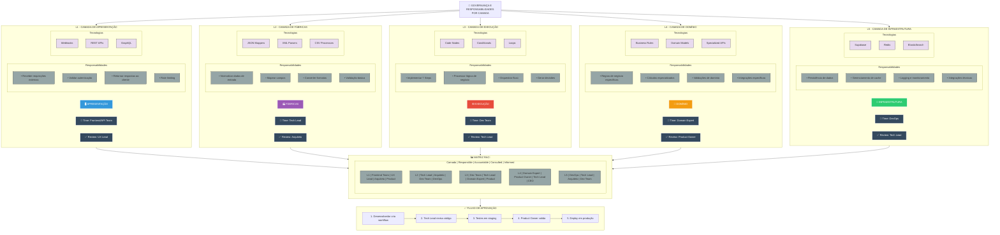

```mermaid
graph TB
    %% Estilização
    classDef l1 fill:#3498DB,stroke:#fff,stroke-width:2px,color:#fff
    classDef l2 fill:#9B59B6,stroke:#fff,stroke-width:2px,color:#fff
    classDef l3 fill:#E74C3C,stroke:#fff,stroke-width:2px,color:#fff
    classDef l4 fill:#F39C12,stroke:#fff,stroke-width:2px,color:#fff
    classDef l5 fill:#2ECC71,stroke:#fff,stroke-width:2px,color:#fff
    classDef team fill:#34495E,stroke:#fff,stroke-width:2px,color:#fff
    classDef resp fill:#95A5A6,stroke:#333,stroke-width:1px,color:#333
    classDef tech fill:#E8DAEF,stroke:#333,stroke-width:1px,color:#333

    %% TÍTULO
    TITLE["🏢 GOVERNANÇA E RESPONSABILIDADES POR CAMADA"]

    %% L1 - APRESENTAÇÃO
    subgraph L1["L1 - CAMADA DE APRESENTAÇÃO"]
        L1_TITLE["🖥️ APRESENTAÇÃO"]:::l1
        
        subgraph L1_RESP["Responsabilidades"]
            L1_R1["• Receber requisições externas"]:::resp
            L1_R2["• Validar autenticação"]:::resp
            L1_R3["• Retornar respostas ao cliente"]:::resp
            L1_R4["• Rate limiting"]:::resp
        end
        
        subgraph L1_TECH["Tecnologias"]
            L1_T1["Webhooks"]:::tech
            L1_T2["REST APIs"]:::tech
            L1_T3["GraphQL"]:::tech
        end
        
        L1_TEAM["👥 Time: Frontend/API Team"]:::team
        L1_REVIEW["✅ Review: UX Lead"]:::team
    end

    %% L2 - FÁBRICAS
    subgraph L2["L2 - CAMADA DE FÁBRICAS"]
        L2_TITLE["🏭 FÁBRICAS"]:::l2
        
        subgraph L2_RESP["Responsabilidades"]
            L2_R1["• Normalizar dados de entrada"]:::resp
            L2_R2["• Mapear campos"]:::resp
            L2_R3["• Converter formatos"]:::resp
            L2_R4["• Validação básica"]:::resp
        end
        
        subgraph L2_TECH["Tecnologias"]
            L2_T1["JSON Mappers"]:::tech
            L2_T2["XML Parsers"]:::tech
            L2_T3["CSV Processors"]:::tech
        end
        
        L2_TEAM["👥 Time: Tech Lead"]:::team
        L2_REVIEW["✅ Review: Arquiteto"]:::team
    end

    %% L3 - EXECUÇÃO
    subgraph L3["L3 - CAMADA DE EXECUÇÃO"]
        L3_TITLE["⚙️ EXECUÇÃO"]:::l3
        
        subgraph L3_RESP["Responsabilidades"]
            L3_R1["• Implementar 7 Steps"]:::resp
            L3_R2["• Processar lógica de negócio"]:::resp
            L3_R3["• Orquestrar fluxo"]:::resp
            L3_R4["• Gerar decisões"]:::resp
        end
        
        subgraph L3_TECH["Tecnologias"]
            L3_T1["Code Nodes"]:::tech
            L3_T2["Conditionals"]:::tech
            L3_T3["Loops"]:::tech
        end
        
        L3_TEAM["👥 Time: Dev Team"]:::team
        L3_REVIEW["✅ Review: Tech Lead"]:::team
    end

    %% L4 - DOMÍNIO
    subgraph L4["L4 - CAMADA DE DOMÍNIO"]
        L4_TITLE["🎯 DOMÍNIO"]:::l4
        
        subgraph L4_RESP["Responsabilidades"]
            L4_R1["• Regras de negócio específicas"]:::resp
            L4_R2["• Cálculos especializados"]:::resp
            L4_R3["• Validações de domínio"]:::resp
            L4_R4["• Integrações específicas"]:::resp
        end
        
        subgraph L4_TECH["Tecnologias"]
            L4_T1["Business Rules"]:::tech
            L4_T2["Domain Models"]:::tech
            L4_T3["Specialized APIs"]:::tech
        end
        
        L4_TEAM["👥 Time: Domain Expert"]:::team
        L4_REVIEW["✅ Review: Product Owner"]:::team
    end

    %% L5 - INFRAESTRUTURA
    subgraph L5["L5 - CAMADA DE INFRAESTRUTURA"]
        L5_TITLE["🔧 INFRAESTRUTURA"]:::l5
        
        subgraph L5_RESP["Responsabilidades"]
            L5_R1["• Persistência de dados"]:::resp
            L5_R2["• Gerenciamento de cache"]:::resp
            L5_R3["• Logging e monitoramento"]:::resp
            L5_R4["• Integrações técnicas"]:::resp
        end
        
        subgraph L5_TECH["Tecnologias"]
            L5_T1["Supabase"]:::tech
            L5_T2["Redis"]:::tech
            L5_T3["ElasticSearch"]:::tech
        end
        
        L5_TEAM["👥 Time: DevOps"]:::team
        L5_REVIEW["✅ Review: Tech Lead"]:::team
    end

    %% MATRIZ DE RESPONSABILIDADES
    subgraph RACI["📊 MATRIZ RACI"]
        subgraph RACI_HEADER["Camada | Responsible | Accountable | Consulted | Informed"]
            R1["L1 | Frontend Team | UX Lead | Arquiteto | Product"]:::resp
            R2["L2 | Tech Lead | Arquiteto | Dev Team | DevOps"]:::resp
            R3["L3 | Dev Team | Tech Lead | Domain Expert | Product"]:::resp
            R4["L4 | Domain Expert | Product Owner | Tech Lead | CEO"]:::resp
            R5["L5 | DevOps | Tech Lead | Arquiteto | Dev Team"]:::resp
        end
    end

    %% FLUXO DE APROVAÇÃO
    subgraph APPROVAL["✅ FLUXO DE APROVAÇÃO"]
        A1["1. Desenvolvedor cria workflow"]
        A2["2. Tech Lead revisa código"]
        A3["3. Testes em staging"]
        A4["4. Product Owner valida"]
        A5["5. Deploy em produção"]
        
        A1 --> A2
        A2 --> A3
        A3 --> A4
        A4 --> A5
    end

    %% CONEXÕES
    TITLE --> L1
    TITLE --> L2
    TITLE --> L3
    TITLE --> L4
    TITLE --> L5
    
    L1 --> RACI
    L2 --> RACI
    L3 --> RACI
    L4 --> RACI
    L5 --> RACI
    
    RACI --> APPROVAL
```

