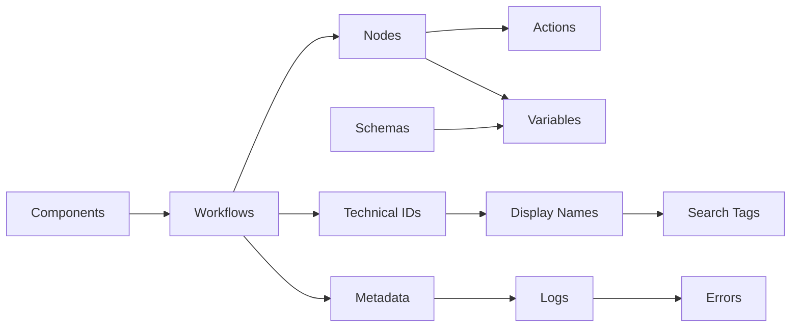

# 📚 CATEGORIAS DE NOMENCLATURA - PROTOCOLO ZION

> **Versão:** 1.0.0
> **Status:** Draft
> **Última Atualização:** Dezembro 2024
> **Tipo:** Especificação de Categorização

---

## 🎯 Visão Geral

Este documento define a estrutura de **6 categorias principais** e suas subcategorias para organização sistemática das nomenclaturas do Protocolo ZION. Cada categoria tem regras específicas, stakeholders responsáveis e padrões de nomenclatura adaptados ao seu contexto.

---

## 📊 ESTRUTURA DE CATEGORIAS

```mermaid
graph TB
    N[NOMENCLATURAS ZION]

    N --> C1[1. ENTIDADES DE SISTEMA]
    C1 --> C1A[1.1 Workflows]
    C1 --> C1B[1.2 Components]
    C1 --> C1C[1.3 Infrastructure]

    N --> C2[2. ELEMENTOS DE EXECUÇÃO]
    C2 --> C2A[2.1 Steps]
    C2 --> C2B[2.2 Nodes]
    C2 --> C2C[2.3 Actions]

    N --> C3[3. DADOS E VARIÁVEIS]
    C3 --> C3A[3.1 Variables]
    C3 --> C3B[3.2 Metadata]
    C3 --> C3C[3.3 Schemas]

    N --> C4[4. COMUNICAÇÃO E LOGS]
    C4 --> C4A[4.1 Messages]
    C4 --> C4B[4.2 Logs]
    C4 --> C4C[4.3 Errors]

    N --> C5[5. ORGANIZAÇÃO E GOVERNANÇA]
    C5 --> C5A[5.1 Files]
    C5 --> C5B[5.2 Versions]
    C5 --> C5C[5.3 Documentation]

    N --> C6[6. IDENTIFICADORES E RELAÇÕES]
    C6 --> C6A[6.1 Technical IDs]
    C6 --> C6B[6.2 Display Names]
    C6 --> C6C[6.3 Search Tags]
```



---

## 1️⃣ CATEGORIA 1: ENTIDADES DE SISTEMA

### Descrição
Elementos principais que compõem a arquitetura do sistema de agentes conversacionais.

### 1.1 Workflows
**Descrição:** Fluxos completos do n8n que implementam funcionalidades específicas

**Padrão:** `[DOMÍNIO]-[CANAL]-[NÚMERO][-SUBFUNÇÃO]`

**Regras:**
```yaml
Formato: XXX-YY-000[-ZZZ]
Domínio: 3 letras maiúsculas
Canal: 2-3 letras maiúsculas
Número: 3 dígitos com zeros à esquerda
Subfunção: Opcional, 3-4 letras

Exemplos Bons:
  - SUP-WA-001 (Suporte WhatsApp básico)
  - VEN-API-042-AUTH (Vendas API com autenticação)
  - MKT-EM-003-NEWS (Marketing Email Newsletter)

Exemplos Ruins:
  - suporte-whatsapp (lowercase, sem padrão)
  - SUP-1 (número sem padding)
  - SUPORTE-WHATSAPP-001 (domínio muito longo)
```

**Stakeholder:** Arquiteto de Soluções
**Quando Definir:** Design-time
**Impacto de Mudança:** Alto (quebra integrações)

### 1.2 Components
**Descrição:** Módulos reutilizáveis (Context Manager, Quality Gates, etc.)

**Padrão:** `[TIPO]-[FUNÇÃO]-[VERSÃO]`

```yaml
Tipos:
  CTX - Context Manager
  QG  - Quality Gates
  VAL - Validators
  ADP - Adapters

Exemplos:
  - CTX-SESSION-V1
  - QG-COMPLIANCE-V2
  - VAL-SCHEMA-V1
```

### 1.3 Infrastructure
**Descrição:** Elementos de infraestrutura e integrações

**Padrão:** `[SERVIÇO]_[AMBIENTE]_[RECURSO]`

```yaml
Exemplos:
  - POSTGRES_PROD_MAIN
  - REDIS_DEV_CACHE
  - API_STAGING_GATEWAY
```

---

## 2️⃣ CATEGORIA 2: ELEMENTOS DE EXECUÇÃO

### Descrição
Componentes que fazem parte da execução dos workflows.

### 2.1 Steps (8-Step Pattern)
**Descrição:** Os 8 passos obrigatórios do padrão ZION

**Padrão FIXO:**
```yaml
1. RECEBE    (REC) - Verde 🟩
2. RASTREIA  (RAS) - Amarelo 🟨
3. VALIDA    (VAL) - Laranja 🟧
4. ROTEIA    (ROT) - Roxo 🟪
5. PROCESSA  (PRO) - Azul 🟦
6. AGREGA    (AGR) - Amarelo 🟨
7. CONFIRMA  (CON) - Laranja 🟧
8. ENTREGA   (ENT) - Verde 🟩

Nomenclatura: [NÚMERO].[SIGLA]:[AÇÃO]
Exemplos:
  - 1.REC:RecebeMensagem
  - 5.PRO:ProcessaComIA
  - 8.ENT:EntregaResposta
```

**Regra:** IMUTÁVEL - Não pode ser alterado

### 2.2 Nodes
**Descrição:** Tipos de nodes do n8n usados nos workflows

**Padrão:** `[STEP].[TYPE]:[NAME]`

```yaml
Types:
  CODE - Code node
  HTTP - HTTP Request
  DB   - Database
  IF   - Conditional
  EXEC - Execute Workflow
  SET  - Set variables

Exemplos:
  - 3.VAL.IF:ValidaSchema
  - 5.PRO.CODE:ProcessaLogica
  - 2.RAS.SET:DefineTraceID
```

### 2.3 Actions
**Descrição:** Ações específicas dentro dos nodes

**Padrão:** `[VERBO]_[OBJETO]_[CONTEXTO]`

```yaml
Verbos: GET, POST, SET, VALIDATE, TRANSFORM, FILTER
Exemplos:
  - GET_USER_DATA
  - VALIDATE_INPUT_SCHEMA
  - TRANSFORM_MESSAGE_FORMAT
```

---

## 3️⃣ CATEGORIA 3: DADOS E VARIÁVEIS

### Descrição
Elementos relacionados a dados, variáveis e estruturas de informação.

### 3.1 Variables
**Descrição:** Variáveis usadas nos workflows

**Padrão:** `[prefix]_[contexto]_[nome]`

```yaml
Prefixos por Tipo:
  str_  - String
  num_  - Number
  bool_ - Boolean
  arr_  - Array
  obj_  - Object
  dt_   - DateTime

Contextos:
  user_   - Dados do usuário
  sys_    - Sistema
  temp_   - Temporário
  config_ - Configuração

Exemplos:
  - str_user_name
  - num_sys_timeout
  - bool_config_debug
  - arr_temp_messages
```

### 3.2 Metadata
**Descrição:** Metadados obrigatórios de rastreamento

**Padrão FIXO:**
```yaml
Obrigatórios:
  trace_id: UUID-v4
  correlation_id: UUID-v4
  session_id: UUID-v4
  timestamp: ISO-8601
  workflow_id: [DOMINIO]-[CANAL]-[NUMERO]

Exemplo:
  {
    "trace_id": "550e8400-e29b-41d4-a716-446655440000",
    "correlation_id": "6ba7b810-9dad-11d1-80b4-00c04fd430c8",
    "session_id": "8a9b7c6d-5e4f-3a2b-1c0d-9e8f7a6b5c4d",
    "timestamp": "2024-12-20T10:00:00Z",
    "workflow_id": "SUP-WA-001"
  }
```

### 3.3 Schemas
**Descrição:** Estruturas de dados padronizadas

**Padrão:** `SCHEMA_[DOMÍNIO]_[ENTIDADE]_[VERSÃO]`

```yaml
Exemplos:
  - SCHEMA_USER_PROFILE_V1
  - SCHEMA_MESSAGE_INPUT_V2
  - SCHEMA_API_RESPONSE_V1
```

---

## 4️⃣ CATEGORIA 4: COMUNICAÇÃO E LOGS

### Descrição
Elementos relacionados a comunicação, mensagens e registro de eventos.

### 4.1 Messages
**Descrição:** Mensagens trocadas com usuários

**Padrão:** `MSG_[TIPO]_[CONTEXTO]_[ID]`

```yaml
Tipos:
  GREETING - Saudação
  PROMPT   - Solicitação
  RESPONSE - Resposta
  ERROR    - Erro
  CONFIRM  - Confirmação

Exemplos:
  - MSG_GREETING_WELCOME_001
  - MSG_ERROR_VALIDATION_402
  - MSG_CONFIRM_ORDER_201
```

### 4.2 Logs
**Descrição:** Registros estruturados de eventos

**Formato:**
```
[TIMESTAMP] [WORKFLOW_ID] [STEP] [LEVEL] [TRACE_ID] [MESSAGE]
```

```yaml
Níveis:
  DEBUG - Informação detalhada
  INFO  - Informação geral
  WARN  - Avisos
  ERROR - Erros recuperáveis
  FATAL - Erros críticos

Exemplo:
  "2024-12-20T10:00:00Z SUP-WA-001 5.PRO INFO 550e8400 Processando mensagem do usuário"
```

### 4.3 Errors
**Descrição:** Códigos de erro padronizados

**Padrão:** `[DOMÍNIO]-[CATEGORIA]-[NÚMERO]`

```yaml
Categorias:
  VAL - Validação
  AUTH - Autenticação
  API - API/Integração
  DB  - Database
  SYS - Sistema

Exemplos:
  - SUP-VAL-001 (Erro de validação no suporte)
  - VEN-AUTH-403 (Não autorizado em vendas)
  - MKT-API-500 (Erro de API em marketing)
```

---

## 5️⃣ CATEGORIA 5: ORGANIZAÇÃO E GOVERNANÇA

### Descrição
Elementos relacionados a estrutura de arquivos, versionamento e documentação.

### 5.1 Files
**Descrição:** Arquivos e diretórios do projeto

**Padrão Diretórios:**
```yaml
/protocolo
  /metodologia      # Metodologias e padrões
  /componentes      # Componentes do sistema
  /nomenclatura     # Regras de nomenclatura
  /especificacao    # Especificações técnicas
  /templates        # Templates visuais
  /exemplos         # Exemplos práticos
```

**Padrão Arquivos:**
```yaml
MAIUSCULAS.md     - Documentos principais
kebab-case.md     - Documentos secundários
CamelCase.json    - Configurações
snake_case.sql    - Scripts SQL
```

### 5.2 Versions
**Descrição:** Versionamento semântico

**Padrão:** `[MAJOR].[MINOR].[PATCH][-STAGE]`

```yaml
Stages:
  -alpha    # Experimental
  -beta     # Testes
  -rc       # Release candidate
  -stable   # Produção
  -hotfix   # Correção urgente

Exemplos:
  - 1.0.0-stable
  - 2.1.0-beta
  - 1.0.1-hotfix
```

### 5.3 Documentation
**Descrição:** Documentação e especificações

**Estrutura:**
```yaml
README.md         - Visão geral
CHANGELOG.md      - Histórico de mudanças
CONTRIBUTING.md   - Guia de contribuição
LICENSE.md        - Licença
[FEATURE].md      - Documentação específica
```

---

## 6️⃣ CATEGORIA 6: IDENTIFICADORES E RELAÇÕES

### Descrição
Sistema híbrido de identificação e descoberta.

### 6.1 Technical IDs
**Descrição:** Identificadores técnicos únicos

**Características:**
- Imutáveis após criação
- Únicos globalmente
- Pattern matching habilitado
- Case-sensitive

### 6.2 Display Names
**Descrição:** Nomes amigáveis em português

**Regras:**
```yaml
- Mínimo 15 caracteres
- Português claro e direto
- Sem jargões técnicos
- Descrever função, não implementação

Exemplos:
  - "Atendimento WhatsApp - Suporte Cliente"
  - "Processamento de Pedidos - E-commerce"
  - "Envio de Newsletter - Marketing"
```

### 6.3 Search Tags
**Descrição:** Tags para descoberta e indexação

**Categorias de Tags:**
```yaml
Funcional:
  - atendimento, suporte, vendas, marketing

Tecnológica:
  - whatsapp, telegram, api, webhook

Complexidade:
  - basico, intermediario, avancado

SLA:
  - tempo_real, rapido, normal, batch
```

---

## 🔄 MATRIZ DE DECISÃO

| Categoria | Quem Define | Quando | Impacto Mudança | Rigidez |
|-----------|------------|---------|-----------------|---------|
| **1.1 Workflows** | Arquiteto | Design | Alto | Alta |
| **1.2 Components** | Tech Lead | Design | Alto | Alta |
| **1.3 Infrastructure** | DevOps | Setup | Crítico | Muito Alta |
| **2.1 Steps** | Protocolo | Fixo | N/A | Imutável |
| **2.2 Nodes** | Developer | Desenvolvimento | Médio | Média |
| **2.3 Actions** | Developer | Desenvolvimento | Baixo | Baixa |
| **3.1 Variables** | Developer | Desenvolvimento | Baixo | Média |
| **3.2 Metadata** | Protocolo | Fixo | N/A | Imutável |
| **3.3 Schemas** | Arquiteto | Design | Alto | Alta |
| **4.1 Messages** | UX/Product | Design | Médio | Baixa |
| **4.2 Logs** | DevOps | Setup | Médio | Alta |
| **4.3 Errors** | Tech Lead | Design | Alto | Alta |
| **5.1 Files** | Tech Lead | Setup | Médio | Média |
| **5.2 Versions** | Release Manager | Release | Alto | Alta |
| **5.3 Documentation** | Todos | Contínuo | Baixo | Baixa |
| **6.1 Technical IDs** | Sistema | Runtime | Crítico | Imutável |
| **6.2 Display Names** | Product | Design | Baixo | Baixa |
| **6.3 Search Tags** | Todos | Contínuo | Baixo | Baixa |

---

## 🔗 INTERDEPENDÊNCIAS



### Regras de Dependência

1. **Technical ID é gerado a partir do Workflow ID**
2. **Display Name deve existir para todo Technical ID**
3. **Search Tags são derivadas de Display Name + Technical ID**
4. **Metadata herda workflow_id do contexto**
5. **Logs sempre incluem trace_id do Metadata**
6. **Errors devem usar domínio do Workflow**
7. **Schemas versionam independentemente**
8. **Components podem ser compartilhados entre Workflows**

---

## 🚀 ORDEM DE IMPLEMENTAÇÃO

### Fase 1: Fundamentos (Semana 1)
1. **Categoria 2.1** - Steps (já definido)
2. **Categoria 6.1** - Technical IDs
3. **Categoria 3.2** - Metadata

### Fase 2: Core (Semana 2)
4. **Categoria 1.1** - Workflows
5. **Categoria 2.2** - Nodes
6. **Categoria 4.3** - Errors

### Fase 3: Expansão (Semana 3)
7. **Categoria 6.2** - Display Names
8. **Categoria 6.3** - Search Tags
9. **Categoria 3.1** - Variables

### Fase 4: Refinamento (Semana 4)
10. **Categoria 4.1** - Messages
11. **Categoria 4.2** - Logs
12. **Categoria 5** - Organização completa

---

## ✅ CHECKLIST DE VALIDAÇÃO POR CATEGORIA

### Para Workflows (1.1)
- [ ] Segue padrão [DOM]-[CANAL]-[NUM]
- [ ] Domínio existe na lista oficial
- [ ] Canal existe na lista oficial
- [ ] Número com 3 dígitos (padding zeros)
- [ ] Subfunção (se houver) com 3-4 letras

### Para Steps (2.1)
- [ ] Usa um dos 8 steps oficiais
- [ ] Inclui sigla de 3 letras
- [ ] Formato [NUM].[SIGLA]:[AÇÃO]
- [ ] Cor corresponde ao padrão

### Para Variables (3.1)
- [ ] Prefixo indica tipo correto
- [ ] Contexto está claro
- [ ] Nome é descritivo
- [ ] Snake_case usado

### Para Errors (4.3)
- [ ] Formato [DOM]-[CAT]-[NUM]
- [ ] Categoria válida (VAL, AUTH, etc)
- [ ] Número único dentro do contexto
- [ ] Documentado com descrição

---

## 📊 MÉTRICAS DE CONFORMIDADE

```yaml
Nível Bronze (Básico):
  - 80% de conformidade nas categorias 1-2
  - Technical IDs corretos
  - 8-Steps implementados

Nível Silver (Intermediário):
  - 90% de conformidade nas categorias 1-4
  - Display Names padronizados
  - Logs estruturados

Nível Gold (Avançado):
  - 95% de conformidade em todas categorias
  - Search Tags otimizadas
  - Documentação completa

Nível Platinum (Excelência):
  - 100% de conformidade
  - Contribuições ao protocolo
  - Casos de uso documentados
```

---

## 🎯 BENEFÍCIOS DA CATEGORIZAÇÃO

1. **Clareza**: Cada elemento tem seu lugar definido
2. **Escalabilidade**: Novas subcategorias podem ser adicionadas
3. **Manutenibilidade**: Regras específicas por contexto
4. **Descobribilidade**: Fácil encontrar padrões relacionados
5. **Governança**: Responsabilidades claras por categoria
6. **Flexibilidade**: Rigidez apropriada por tipo

---

## 📝 NOTAS DE IMPLEMENTAÇÃO

- Categorias 1-3 são **CORE** e devem ser implementadas primeiro
- Categorias 4-6 são **SUPORTE** e podem evoluir gradualmente
- Steps (2.1) e Metadata (3.2) são **IMUTÁVEIS**
- Display Names (6.2) têm máxima **FLEXIBILIDADE**
- Technical IDs (6.1) têm máxima **RIGIDEZ**

---

*Este documento é parte do Protocolo de Agentes No-Code Zion (PANZ) v1.0.0*