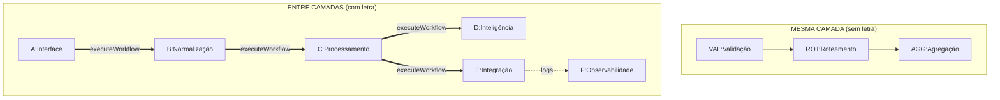

# Convenção de Nomenclatura - Camadas e Workflows

> **Versão:** 2.0.0
> **Protocolo:** Zion
> **Padrão:** Arquitetura em Camadas
> **Baseado em:** INT-CNX-001 (Implementação Real)

## 🔷 Mapeamento Octógono Zion ↔️ Camadas

### Como o Octógono se relaciona com as Camadas

| Step Octógono | Camada Principal | Prefixo | Cor n8n | Exemplo Real (INT-CNX-001) |
|---------------|------------------|---------|---------|---|
| 1. RECEBE | (A) Interface | `A:` | 🟠 color:2 | `A:Recebe dados conexao` |
| 2. RASTREIA | Mesma camada | `RAS:` | ⬜ color:7 | `RAS:Execução tratador` |
| 3. VALIDA | Mesma camada | `VAL:` | 🟢 color:4 | `VAL:ParametrosValidos` |
| 4. ROTEIA | Mesma camada | `ROT:` | 🔵 color:5 | `ROT:SelecionaEstrategiaQuery` |
| 5. PROCESSA | (B) Normalização + (C) Processamento | `B:` `C:` | 🟡 color:3 | `B:NOR:Conexao > sistema` |
| 6. AGREGA | (E) Integração ou local | `E:AGG:` `AGG:` | ⬜ color:7 | `E:AGG:Debouncer` |
| 7. CONFIRMA | Mesma camada | `VAL:` | 🟢 color:4 | `VAL:Dados Validos Processador` |
| 8. ENTREGA | (C) Processamento | `C:` | 🟠 color:2 | `C:CMP:Executa motor de resposta` |

## 🏗️ Estrutura de Camadas

### Nomenclatura de Workflows

#### **COM LETRA - Chamada Entre Camadas**
Quando um node executa um workflow de OUTRA camada via `executeWorkflow`:
```
[LETRA]:[CONTEXTO]:[DESCRIÇÃO]
```

**Exemplos Reais do INT-CNX-001:**

```javascript
// 🟠 (A) Interface - Camada de entrada
"A:Recebe dados conexao"  // Webhook que recebe de WhatsApp/Telegram
// Node: webhook (type: n8n-nodes-base.webhook)
// Position: [896, 752]
// Sticky Note: color:2 (laranja)

// 🟡 (B) Normalização - Transformação de dados
"B:NOR:Conexao > sistema"       // Normaliza body para formato interno
"B:NOR:Conexao > funcionalidades" // Adapta funcionalidades por conexão
// Node: executeWorkflow para camada B
// WorkflowId: Krdi6CaDNjI1Wtln (Adaptador)
// Position: [1792, 544]

// 🔵 (C) Processamento - Motor principal
"C:CMP:Executa motor de resposta" // Core do processamento
"C2:MensagemHistorico"           // Componente secundário (disabled)
// Node: executeWorkflow para camada C
// WorkflowId: yKZ3SmJXgtveMZGt (Processador)
// Position: [4080, 368]

// 🟣 (D) Inteligência - IA/LLMs
// Ainda não implementado no INT-CNX-001
// Futuramente: "D:LLM:GPT4", "D:AI:Claude"

// 🔴 (E) Integração - Serviços externos
"E:CNV:Converte midia em texto"   // Converte áudio/imagem
"E:INT:Buscar servicos no banco"  // Busca integrações no DB
"E:BCO:Busca entidade agente"     // Query no banco
"E:AGG:Debouncer"                 // Agregador com delay
// Node: executeWorkflow para camada E
// WorkflowId: pbb2dCaOXY6t8zGw (Tradutor Mídias)
// Position: [2896, 384]

// ⬜ (F) Observabilidade - Monitoramento
// Ainda não implementado no INT-CNX-001
// Futuramente: "F:LOG:Eventos", "F:MET:Performance"
```

#### **SEM LETRA - Operação Interna**
Quando o node opera DENTRO da mesma camada (não chama outro workflow):
```
[TIPO]:[DESCRIÇÃO]
```

**Exemplos Reais do INT-CNX-001:**

```javascript
// ✅ Validações internas (type: if/switch)
"VAL:ParametrosValidos"            // Position: [1344, 752]
"VAL:Agente deve continuar?"       // Position: [2224, 544]
"VAL:Agente deve processar midia?" // Position: [2448, 464]
"VAL:Dados Validos Processador"    // Position: [3824, 480]

// 🔀 Roteamento interno (type: switch)
"ROT:SelecionaEstrategiaQuery"     // Position: [1552, 656]
// Outputs: query | params

// 📍 Rastreamento interno (type: executionData)
"RAS:Execução tratador"            // Position: [1120, 752]
// Salva: control, company, connection

// 🔗 Agregação interna (type: noOp)
"AGG:UnificaMidia"                 // Position: [3152, 480]

// ❌ Erros internos (type: stopAndError)
"ERR:Parametros"                   // Position: [1792, 752]
// Message: "A Jana nao funciona mais com params, somente com query."

"ERR: Conexao inexistente"         // Position: [1552, 864]
// Message: "Conflito de parâmetros: connection e company não foram inseridos"

"ERR: Invalido"                    // Position: [4080, 592]
// Message: "Invalido"
```

## 📁 Estrutura de Repositório

### Padrão de Nome de Arquivo
```
[tipo]-[contexto]-[descrição] ([CÓDIGO]).json
```

**Exemplo:**
```
interface-conexao-webhook (INT-CNX-001).json
```

### Decomposição:
- `interface` - Tipo/Camada
- `conexao` - Contexto
- `webhook` - Descrição específica
- `INT-CNX-001` - Código único

## 🔤 Mapeamento de Letras para Camadas

| Letra | Camada | Descrição | Pastas no n8n |
|-------|--------|-----------|---------------|
| **A** | Interface | Entrada de dados, webhooks, APIs | `(A) Interface` |
| **B** | Normalização | Transformações, adaptadores | `(B) Normalização` |
| **C** | Processamento | Lógica principal, motor de negócio | `(C) Processamento` |
| **D** | Inteligência | IA, LLMs, análise | `(D) Inteligência` |
| **E** | Integração | Serviços externos, APIs, bancos | `(E) Integração` |
| **F** | Observabilidade | Logs, métricas, monitoring | `(F) Observabilidade` |

## 🎯 Regras de Uso

### ✅ USE LETRA quando:
1. Node do tipo `executeWorkflow`
2. Chama workflow de outra camada
3. Precisa isolar responsabilidades
4. Requer processamento em outro contexto

### ❌ NÃO USE LETRA quando:
1. Operação dentro da mesma camada
2. Nodes de validação simples (`if`, `switch`)
3. Transformações locais (`set`, `function`)
4. Roteamento interno
5. Tratamento de erros local

## 📊 Estrutura no n8n

As pastas aparecem organizadas alfabeticamente no n8n:
```
Personal / Sandro Borges / Jana - Aprendizado /
  ├── (A) Interface         # 1 Workflow
  ├── (B) Normalização      # 1 Workflow
  ├── (C) Processamento     # 1 Workflow
  ├── (D) Inteligência      # 0 Workflows (vazio)
  ├── (E) Integração        # 2 Workflows
  └── (F) Observabilidade   # 0 Workflows (vazio)
```

### Estrutura de Arquivos Sugerida
```
/protocolo
  /especificacao
    /(A) Interface
      interface-conexao-webhook (INT-CNX-001).json
      interface-rest-api (INT-API-001).json

    /(B) Normalizacao
      normalizacao-adaptador-contact (NOR-ADP-001).json
      normalizacao-transformer-data (NOR-TRF-001).json

    /(C) Processamento
      processamento-motor-resposta (PRO-MOT-001).json
      processamento-engine-core (PRO-ENG-001).json

    /(D) Inteligencia
      inteligencia-llm-processor (INT-LLM-001).json
      inteligencia-ai-analyzer (INT-ANL-001).json

    /(E) Integracao
      integracao-banco-buscar (INT-BCO-001).json
      integracao-api-externa (INT-API-001).json

    /(F) Observabilidade
      observabilidade-logs-collector (OBS-LOG-001).json
      observabilidade-metrics-tracker (OBS-MET-001).json
```

## 🔄 Fluxo Entre Camadas



## 📝 Metadados e Estrutura Real

### Exemplo Real do INT-CNX-001
```json
{
  "meta": {
    "instanceId": "13e69768d9105474f419387ffa19b4983ca3540caed4fb88ead28d7a04e5c816",
    "protocol": "ZION-v1.0",
    "pattern": "INT-CNX-001"
  },
  "nodes": [
    {
      "name": "A:Recebe dados conexao",
      "type": "n8n-nodes-base.webhook",
      "typeVersion": 2.1,
      "position": [896, 752],
      "webhookId": "854abc64-c10f-47fd-bde0-08bb96e74d5f",
      "parameters": {
        "httpMethod": "POST",
        "path": "agents/"
      },
      "notesInFlow": true,
      "notes": "Recebe de conexoes"
    },
    {
      "name": "B:NOR:Conexao > sistema",
      "type": "n8n-nodes-base.executeWorkflow",
      "typeVersion": 1.2,
      "position": [1792, 544],
      "parameters": {
        "workflowId": {
          "value": "Krdi6CaDNjI1Wtln",
          "cachedResultName": "[Jana] (Adaptador) Buscas no banco interno"
        }
      },
      "notesInFlow": true,
      "notes": "Monta o body pra tudo no sistema"
    },
    {
      "name": "VAL:ParametrosValidos",
      "type": "n8n-nodes-base.if",
      "typeVersion": 2.2,
      "position": [1344, 752],
      "parameters": {
        "conditions": {
          "conditions": [{
            "leftValue": "={{ $json.query }}",
            "rightValue": "",
            "operator": {
              "type": "object",
              "operation": "notEmpty"
            }
          }]
        }
      }
    },
    {
      "name": "ERR:Parametros",
      "type": "n8n-nodes-base.stopAndError",
      "typeVersion": 1,
      "position": [1792, 752],
      "parameters": {
        "errorMessage": "A Jana nao funciona mais com params, somente com query."
      }
    }
  ],
  "stickyNotes": [
    {
      "name": "Sticky Note10",
      "content": "### 1. RECEBE\n- [x] Workflow\n- [ ] Webhook\n- [ ] Rabbit\n- [ ] Evaluations",
      "position": [864, 224],
      "color": 2  // 🟠 Laranja
    },
    {
      "name": "Sticky Note6",
      "content": "### 5. PROCESSA",
      "position": [1744, -192],
      "color": 3  // 🟡 Amarelo
    }
  ]
}
```

## ✅ Checklist de Nomenclatura

Para nodes **COM LETRA**:
- [ ] É um executeWorkflow?
- [ ] Chama workflow de outra camada?
- [ ] Letra corresponde à camada destino?
- [ ] Nome segue padrão `[LETRA]:[CONTEXTO]:[AÇÃO]`?

Para nodes **SEM LETRA**:
- [ ] Opera na mesma camada?
- [ ] É validação, roteamento ou agregação local?
- [ ] Nome segue padrão `[TIPO]:[DESCRIÇÃO]`?

Para **arquivos**:
- [ ] Nome segue padrão `tipo-contexto-descrição (CÓDIGO).json`?
- [ ] Código é único no sistema?
- [ ] Está no diretório correto da camada?

## 🚀 Exemplo de Implementação Completa

### Fluxo Completo INT-CNX-001

```
1. A:Recebe dados conexao (webhook)
   ↓
2. RAS:Execução tratador (salva metadados)
   ↓
3. VAL:ParametrosValidos (if - query existe?)
   ├─ ✅ Sim
   │   ↓
   │   4. ROT:SelecionaEstrategiaQuery (switch - query ou params?)
   │   ├─ Query
   │   │   ↓
   │   │   5. B:NOR:Conexao > sistema (executeWorkflow)
   │   │   ↓
   │   │   6. B:NOR:Conexao > funcionalidades (executeWorkflow)
   │   │   ↓
   │   │   7. VAL:Agente deve continuar? (if)
   │   │   ├─ Sim
   │   │   │   ↓
   │   │   │   8. VAL:Agente deve processar midia? (if)
   │   │   │   ├─ Sim
   │   │   │   │   ↓
   │   │   │   │   9. E:INT:Buscar servicos no banco (executeWorkflow)
   │   │   │   │   ↓
   │   │   │   │   10. E:CNV:Converte midia em texto (executeWorkflow)
   │   │   │   │   ↓
   │   │   │   │   11. AGG:UnificaMidia (noOp)
   │   │   │   └─ Não
   │   │   │       ↓
   │   │   │       11. AGG:UnificaMidia (noOp)
   │   │   └─ Não
   │   │       ↓
   │   │       (fim)
   │   └─ Params
   │       ↓
   │       ERR:Parametros (stopAndError)
   └─ ❌ Não
       ↓
       ERR: Conexao inexistente (stopAndError)

12. E:BCO:Busca entidade agente (executeWorkflow)
    ↓
13. E:AGG:Debouncer (executeWorkflow)
    ↓
14. VAL:Dados Validos Processador (if)
    ├─ Sim
    │   ↓
    │   15. C:CMP:Executa motor de resposta (executeWorkflow)
    └─ Não
        ↓
        ERR: Invalido (stopAndError)
```

---

*Baseado no workflow INT-CNX-001 implementado em produção - Jana 4.1*