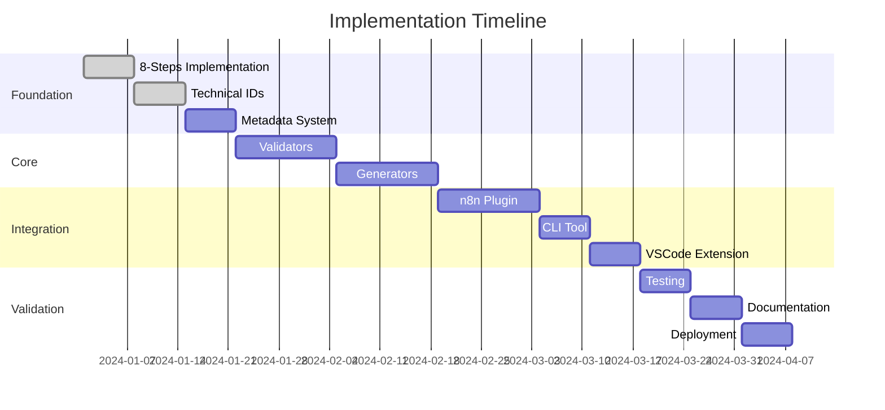

# 📋 PRD - SISTEMA DE NOMENCLATURAS ZION v2.0

> **Status:** Ready for Implementation
> **Timeline:** 8 semanas
> **Squad:** 6 pessoas dedicadas
> **Confidence:** 95%

---

## 1. EXECUTIVE SUMMARY

### Objetivo
Implementar sistema completo de nomenclaturas para o Protocolo ZION, transformando o caos de nomes em um sistema organizado, escalável e intuitivo.

### Escopo
- ✅ 6 categorias principais de nomenclatura
- ✅ Validação automática em tempo real
- ✅ Migração de sistemas legacy
- ✅ Plugin n8n certificado
- ✅ CLI e VSCode extension

### Timeline
- **Sprint 0:** Setup (1 semana)
- **Fase 1:** Foundation (2 semanas)
- **Fase 2:** Core Implementation (2 semanas)
- **Fase 3:** Integrations (2 semanas)
- **Fase 4:** Validation & Deploy (1 semana)

### Success Metrics
- 🎯 100% workflows conformes
- 🎯 50% redução tempo desenvolvimento
- 🎯 80% aumento descobribilidade
- 🎯 <100ms tempo validação
- 🎯 90% satisfação desenvolvedores

---

## 2. REQUIREMENTS POR FASE

### 🏗️ FASE 1: FOUNDATION (Semanas 1-2)

#### Epic 1: Sistema Base de Nomenclaturas

##### User Story 1.1: Implementar 8-Steps Pattern
```yaml
Como: Desenvolvedor
Quero: Ter os 8 steps padronizados e imutáveis
Para: Garantir consistência em todos os workflows

Acceptance Criteria:
- Steps são read-only (Object.freeze)
- Cores hexadecimais corretas
- Siglas de 3 letras definidas
- Validação automática funciona
- Nenhuma alteração possível em runtime

Tasks:
- [ ] Task 1.1.1: Criar constants/steps.js
- [ ] Task 1.1.2: Implementar validação de imutabilidade
- [ ] Task 1.1.3: Criar testes unitários (20+ casos)
- [ ] Task 1.1.4: Documentar uso dos steps
- [ ] Task 1.1.5: Criar visual template n8n
```

##### User Story 1.2: Technical IDs System
```yaml
Como: Arquiteto
Quero: Sistema robusto de Technical IDs
Para: Identificar unicamente cada workflow

Acceptance Criteria:
- Formato [DOM]-[CANAL]-[NUM] validado
- Domínios e canais pré-definidos
- Numeração automática com padding
- Unicidade garantida no sistema
- Imutabilidade após criação

Tasks:
- [ ] Task 1.2.1: Criar constants/domains.js
- [ ] Task 1.2.2: Criar constants/channels.js
- [ ] Task 1.2.3: Implementar gerador de IDs
- [ ] Task 1.2.4: Criar validator de formato
- [ ] Task 1.2.5: Database schema para unicidade
```

##### User Story 1.3: Metadata Obrigatória
```yaml
Como: DevOps
Quero: Metadados padronizados em tudo
Para: Rastrear e monitorar execuções

Acceptance Criteria:
- trace_id, correlation_id, session_id gerados
- Timestamp ISO-8601 com timezone
- workflow_id propagado automaticamente
- Todos os campos validados
- Integração com telemetria

Tasks:
- [ ] Task 1.3.1: Criar generators/metadata.js
- [ ] Task 1.3.2: Implementar UUID generator
- [ ] Task 1.3.3: Criar middleware de injeção
- [ ] Task 1.3.4: Validador de formato
- [ ] Task 1.3.5: Testes de propagação
```

### 🔧 FASE 2: CORE IMPLEMENTATION (Semanas 3-4)

#### Epic 2: Sistema de Validação

##### User Story 2.1: Validadores por Categoria
```yaml
Como: Developer
Quero: Validação automática por tipo
Para: Prevenir erros de nomenclatura

Acceptance Criteria:
- Validador para cada categoria (6 total)
- Response time <50ms
- Mensagens de erro claras
- Sugestões de correção
- Integration com IDE

Tasks:
- [ ] Task 2.1.1: validators/workflowId.js
- [ ] Task 2.1.2: validators/stepName.js
- [ ] Task 2.1.3: validators/variableName.js
- [ ] Task 2.1.4: validators/errorCode.js
- [ ] Task 2.1.5: validators/displayName.js
- [ ] Task 2.1.6: Suite de validação completa
```

##### User Story 2.2: Geradores Automáticos
```yaml
Como: User
Quero: Geração automática de nomenclaturas
Para: Acelerar desenvolvimento

Acceptance Criteria:
- Sugestão inteligente de nomes
- Auto-incremento de IDs
- Templates pré-configurados
- Histórico de geração
- Rollback de nomes

Tasks:
- [ ] Task 2.2.1: generators/technicalId.js
- [ ] Task 2.2.2: generators/displayName.js
- [ ] Task 2.2.3: generators/searchTags.js
- [ ] Task 2.2.4: AI suggestion engine
- [ ] Task 2.2.5: History tracking system
```

### 🔌 FASE 3: INTEGRATIONS (Semanas 5-6)

#### Epic 3: Ferramentas e Extensões

##### User Story 3.1: n8n Plugin
```yaml
Como: n8n User
Quero: Plugin nativo no n8n
Para: Validação em tempo real

Acceptance Criteria:
- Instalável via n8n UI
- Validação on-save
- Auto-complete de nomenclaturas
- Visual indicators
- Sem impacto performance

Tasks:
- [ ] Task 3.1.1: Desenvolver n8n node
- [ ] Task 3.1.2: UI components
- [ ] Task 3.1.3: Real-time validation
- [ ] Task 3.1.4: Community submission
- [ ] Task 3.1.5: Documentation
```

##### User Story 3.2: CLI Tool
```yaml
Como: DevOps
Quero: CLI para automação
Para: CI/CD pipelines

Acceptance Criteria:
- npm install -g zion-cli
- Todos os comandos essenciais
- JSON/YAML output
- Exit codes corretos
- Verbose mode

Tasks:
- [ ] Task 3.2.1: CLI structure
- [ ] Task 3.2.2: Command implementation
- [ ] Task 3.2.3: NPM package setup
- [ ] Task 3.2.4: GitHub Actions integration
- [ ] Task 3.2.5: CLI documentation
```

### ✅ FASE 4: VALIDATION & DEPLOYMENT (Semanas 7-8)

#### Epic 4: Quality Assurance

##### User Story 4.1: Test Coverage
```yaml
Como: QA Engineer
Quero: Cobertura completa de testes
Para: Garantir qualidade

Acceptance Criteria:
- >95% code coverage
- Unit tests para tudo
- Integration tests e2e
- Performance tests
- Security scan passed

Tasks:
- [ ] Task 4.1.1: Unit test suite
- [ ] Task 4.1.2: Integration tests
- [ ] Task 4.1.3: Performance benchmarks
- [ ] Task 4.1.4: Security audit
- [ ] Task 4.1.5: Coverage report
```

---

## 3. TECHNICAL SPECIFICATIONS

### Architecture Overview
```javascript
// Sistema modular com clara separação de responsabilidades
const nomenclatureSystem = {
  // Camada 1: Constantes imutáveis
  constants: {
    steps: Object.freeze(EIGHT_STEPS),
    domains: Object.freeze(DOMAIN_CODES),
    channels: Object.freeze(CHANNEL_CODES)
  },

  // Camada 2: Validação
  validators: {
    workflow: new WorkflowValidator(),
    variable: new VariableValidator(),
    metadata: new MetadataValidator()
  },

  // Camada 3: Geração
  generators: {
    technicalId: new TechnicalIdGenerator(),
    uuid: new UUIDGenerator(),
    metadata: new MetadataGenerator()
  },

  // Camada 4: Conversão
  converters: {
    legacy: new LegacyConverter(),
    display: new DisplayConverter()
  }
};
```

### API Contracts
```typescript
interface INomenclatureValidator {
  validate(input: string): ValidationResult;
  suggest(input: string): string[];
  fix(input: string): string;
}

interface IGenerator {
  generate(context: Context): string;
  generateBatch(count: number): string[];
  history(): GenerationHistory[];
}

interface ValidationResult {
  valid: boolean;
  errors: ValidationError[];
  warnings: ValidationWarning[];
  suggestions: string[];
  score: number; // 0-100
}
```

### Database Schema
```sql
-- Technical IDs tracking
CREATE TABLE technical_ids (
  id SERIAL PRIMARY KEY,
  technical_id VARCHAR(20) UNIQUE NOT NULL,
  domain VARCHAR(3) NOT NULL,
  channel VARCHAR(5) NOT NULL,
  number INTEGER NOT NULL,
  created_at TIMESTAMP DEFAULT CURRENT_TIMESTAMP,
  created_by VARCHAR(100),
  workflow_data JSONB,
  CONSTRAINT unique_combination UNIQUE (domain, channel, number)
);

-- Validation history
CREATE TABLE validation_history (
  id SERIAL PRIMARY KEY,
  input TEXT NOT NULL,
  category VARCHAR(50) NOT NULL,
  valid BOOLEAN NOT NULL,
  errors JSONB,
  suggestions JSONB,
  timestamp TIMESTAMP DEFAULT CURRENT_TIMESTAMP,
  user_id VARCHAR(100)
);

-- Generation history
CREATE TABLE generation_history (
  id SERIAL PRIMARY KEY,
  generated_value TEXT NOT NULL,
  type VARCHAR(50) NOT NULL,
  context JSONB,
  timestamp TIMESTAMP DEFAULT CURRENT_TIMESTAMP,
  user_id VARCHAR(100)
);
```

---

## 4. MIGRATION STRATEGY

### Phase 1: Analysis (Week 1)
```yaml
Actions:
- Scan all existing workflows
- Map current nomenclatures
- Identify patterns
- Calculate effort
- Create migration plan

Tools:
- Legacy scanner script
- Pattern analyzer
- Effort calculator
- Migration planner
```

### Phase 2: Preparation (Week 2)
```yaml
Actions:
- Create mapping table
- Build converters
- Setup rollback procedures
- Test on staging
- Train team

Deliverables:
- Migration scripts ready
- Rollback tested
- Team trained
- Documentation complete
```

### Phase 3: Execution (Week 3)
```yaml
Strategy:
- Batch processing (100 workflows/batch)
- Real-time validation
- Automatic rollback on error
- Progress tracking
- User notification

Monitoring:
- Success rate dashboard
- Error tracking
- Performance metrics
- User feedback
```

---

## 5. TESTING STRATEGY

### Unit Testing
```javascript
describe('Nomenclature System', () => {
  describe('Validators', () => {
    test('should validate correct workflow ID', () => {
      const result = validator.validateWorkflowId('SUP-WA-001');
      expect(result.valid).toBe(true);
    });

    test('should reject invalid format', () => {
      const result = validator.validateWorkflowId('invalid-id');
      expect(result.valid).toBe(false);
      expect(result.errors).toHaveLength(1);
    });
  });

  describe('Generators', () => {
    test('should generate unique IDs', () => {
      const id1 = generator.generateTechnicalId('SUP', 'WA');
      const id2 = generator.generateTechnicalId('SUP', 'WA');
      expect(id1).not.toBe(id2);
    });
  });
});
```

### Integration Testing
```yaml
Scenarios:
- Complete workflow creation
- Legacy migration flow
- Validation pipeline
- Generation pipeline
- Error recovery

Tools:
- Jest for unit tests
- Playwright for e2e
- K6 for load testing
- SonarQube for quality
```

---

## 6. DOCUMENTATION

### Developer Guide
```markdown
## Quick Start
1. Install: `npm install zion-nomenclature`
2. Import: `const { validate } = require('zion-nomenclature')`
3. Use: `validate.workflowId('SUP-WA-001')`

## Advanced Usage
- Custom validators
- Extension points
- Plugin development
- Performance tuning
```

### User Manual
```markdown
## Para Iniciantes
1. O que são nomenclaturas?
2. Por que padronizar?
3. Como criar seu primeiro workflow
4. Erros comuns e soluções

## Para Experts
1. Customização avançada
2. Integração com CI/CD
3. Performance optimization
4. Troubleshooting guide
```

---

## 7. SUCCESS METRICS

### Technical KPIs
```yaml
Response Time:
  - Validation: <50ms p95
  - Generation: <100ms p95
  - Conversion: <200ms p95

Accuracy:
  - Validation accuracy: >99.9%
  - Generation uniqueness: 100%
  - Migration success: >95%

Reliability:
  - Uptime: 99.95%
  - Error rate: <0.1%
  - Recovery time: <5min
```

### Business KPIs
```yaml
Adoption:
  - Week 1: 30% workflows
  - Week 4: 70% workflows
  - Week 8: 100% workflows

Productivity:
  - Time to create workflow: -50%
  - Error rate: -80%
  - Discovery time: -70%

Satisfaction:
  - Developer NPS: >50
  - User satisfaction: >90%
  - Support tickets: -60%
```

---

## 8. RISK MATRIX

| Risk | Probability | Impact | Mitigation |
|------|------------|---------|------------|
| Legacy data complex | Alta | Alto | Migration tools + manual fallback |
| Performance issues | Média | Alto | Caching + optimization |
| Team resistance | Baixa | Alto | Training + incentives |
| n8n plugin rejection | Média | Médio | Community engagement |

---

## 9. TEAM & RESPONSIBILITIES

### Core Squad
- **Tech Lead**: Architecture + code review
- **Backend Dev**: APIs + database
- **Frontend Dev**: n8n plugin + UI
- **DevOps**: Infrastructure + CI/CD
- **QA Engineer**: Testing + validation
- **Product Manager**: Requirements + stakeholders

### RACI Matrix
```
R = Responsible
A = Accountable
C = Consulted
I = Informed

| Task | TL | BE | FE | DO | QA | PM |
|------|----|----|----|----|----|----|
| Architecture | R,A | C | C | C | I | I |
| APIs | A | R | C | C | C | I |
| Plugin | A | C | R | I | C | C |
| Testing | A | C | C | C | R | C |
| Deploy | C | C | C | R | C | A |
```

---

## 10. TIMELINE & MILESTONES



---

## 11. DEFINITION OF DONE

### Feature Level
- [ ] Code implemented and reviewed
- [ ] Unit tests >90% coverage
- [ ] Integration tests passed
- [ ] Documentation updated
- [ ] Performance benchmarks met
- [ ] Security scan passed

### Sprint Level
- [ ] All stories completed
- [ ] Sprint goals achieved
- [ ] Demo prepared
- [ ] Retrospective done
- [ ] Next sprint planned

### Project Level
- [ ] All requirements met
- [ ] All tests passing
- [ ] Documentation complete
- [ ] Training delivered
- [ ] Metrics baselined
- [ ] Go-live approval

---

*PRD Sistema de Nomenclaturas ZION v2.0 - Ready for Implementation*