# Template Visual do Octógono Zion

## 🎨 Guia Visual para Implementação no n8n

### Estrutura Visual do Workflow

```mermaid
graph TB
    %% Estilos para cada step com cores do Octogono Zion
    classDef recebeClass fill:#FF9800,stroke:#E65100,color:#FFF,stroke-width:3px
    classDef rastreiaClass fill:#9E9E9E,stroke:#616161,color:#FFF,stroke-width:3px
    classDef validaClass fill:#4CAF50,stroke:#2E7D32,color:#FFF,stroke-width:3px
    classDef roteiaClass fill:#2196F3,stroke:#1565C0,color:#FFF,stroke-width:3px
    classDef processaClass fill:#FFEB3B,stroke:#F9A825,color:#000,stroke-width:3px
    classDef agregaClass fill:#9E9E9E,stroke:#616161,color:#FFF,stroke-width:3px
    classDef confirmaClass fill:#4CAF50,stroke:#2E7D32,color:#FFF,stroke-width:3px
    classDef entregaClass fill:#FF9800,stroke:#E65100,color:#FFF,stroke-width:3px

    %% Título
    Title["🔷 WORKFLOW OCTOGONO ZION 🔷<br/>━━━━━━━━━━━━━━━━━━━━━━━━━━"]

    %% Step 1 - RECEBE
    subgraph S1["🟢 1. RECEBE"]
        R1["⚡ Webhook"]
        R2["📋 Workflow"]
        R3["🐰 RabbitMQ"]
    end

    %% Step 2 - RASTREIA
    subgraph S2["🟡 2. RASTREIA"]
        T1["🔍 Trace IDs"]
        T2["📊 Telemetry"]
        T3["🏷️ Metadata"]
    end

    %% Step 3 - VALIDA
    subgraph S3["🟠 3. VALIDA"]
        V1["✅ Validate Rules"]
        V2["🔐 Security Check"]
        V3["📏 Data Schema"]
    end

    %% Step 4 - ROTEIA
    subgraph S4["🟣 4. ROTEIA"]
        RO1["🗺️ Route Strategy"]
        RO2["⚡ Priority Queue"]
        RO3["🎯 Target Service"]
    end

    %% Step 5 - PROCESSA
    subgraph S5["🔵 5. PROCESSA"]
        P1["🧠 Business Logic"]
        P2["🤖 AI/LLM Engine"]
        P3["⚙️ Core Processing"]
    end

    %% Step 6 - AGREGA
    subgraph S6["🟡 6. AGREGA"]
        A1["🔗 Aggregate Data"]
        A2["✨ Combine Results"]
        A3["📦 Enrich Context"]
    end

    %% Step 7 - CONFIRMA
    subgraph S7["🟠 7. CONFIRMA"]
        C1["✔️ Quality Gates"]
        C2["📋 Compliance Check"]
        C3["🎯 Success Criteria"]
    end

    %% Step 8 - ENTREGA
    subgraph S8["🟢 8. ENTREGA"]
        E1["📤 Deliver Output"]
        E2["🔄 Update State"]
        E3["✅ Notify Success"]
    end

    %% Fluxo principal sequencial
    Title -.-> S1
    S1 ==> S2
    S2 ==> S3
    S3 ==> S4
    S4 ==> S5
    S5 ==> S6
    S6 ==> S7
    S7 ==> S8

    %% Conexões internas
    R1 --> T1
    R2 --> T1
    R3 --> T1

    T1 --> V1
    T2 --> V2

    V1 --> RO1
    V2 --> RO1
    V3 --> RO2

    RO1 --> P1
    RO2 --> P2
    RO3 --> P3

    P1 --> A1
    P2 --> A2
    P3 --> A3

    A1 --> C1
    A2 --> C2
    A3 --> C3

    C1 --> E1
    C2 --> E2
    C3 --> E3

    %% Aplicar estilos
    class S1,R1,R2,R3 recebeClass
    class S2,T1,T2,T3 rastreiaClass
    class S3,V1,V2,V3 validaClass
    class S4,RO1,RO2,RO3 roteiaClass
    class S5,P1,P2,P3 processaClass
    class S6,A1,A2,A3 agregaClass
    class S7,C1,C2,C3 confirmaClass
    class S8,E1,E2,E3 entregaClass
```



## 📍 Configuração de Cores no n8n

### Como configurar as Sticky Notes:

1. **Passo 1 - RECEBE** 🟠
   - Cor: #FF9800 (Laranja) - n8n color: 2
   - Webhook, HTTP Request, RabbitMQ Trigger

2. **Passo 2 - RASTREIA** ⬜
   - Cor: #9E9E9E (Cinza) - n8n color: 7
   - Generate IDs, Add Metadata, Telemetry

3. **Passo 3 - VALIDA** 🟢
   - Cor: #4CAF50 (Verde) - n8n color: 4
   - IF conditions, Data validation, Security checks

4. **Passo 4 - ROTEIA** 🔵
   - Cor: #2196F3 (Azul) - n8n color: 5
   - Switch nodes, Router logic, Strategy decisions

5. **Passo 5 - PROCESSA** 🟡
   - Cor: #FFEB3B (Amarelo) - n8n color: 3
   - AI nodes, Business logic, Core processing

6. **Passo 6 - AGREGA** ⬜
   - Cor: #9E9E9E (Cinza) - n8n color: 7
   - Merge, Aggregate, Combine data

7. **Passo 7 - CONFIRMA** 🟢
   - Cor: #4CAF50 (Verde) - n8n color: 4
   - Quality gates, Compliance checks, Validation

8. **Passo 8 - ENTREGA** 🟠
   - Cor: #FF9800 (Laranja) - n8n color: 2
   - Send response, Update database, Notify

## 📋 Template n8n JSON

```json
{
  "name": "Octogono Zion Template",
  "nodes": [
    {
      "type": "n8n-nodes-base.webhook",
      "name": "1.REC:WEBHOOK",
      "position": [250, 300],
      "parameters": {
        "httpMethod": "POST",
        "path": "zion-webhook"
      }
    },
    {
      "type": "n8n-nodes-base.function",
      "name": "2.RAS:TRACE_ID",
      "position": [450, 300],
      "parameters": {
        "functionCode": "// Generate trace ID\nconst traceId = `zion-${Date.now()}-${Math.random().toString(36).substr(2, 9)}`;\nreturn [{json: {...$json, trace_id: traceId}}];"
      }
    },
    {
      "type": "n8n-nodes-base.if",
      "name": "3.VAL:SECURITY",
      "position": [650, 300],
      "parameters": {
        "conditions": {
          "string": [{
            "value1": "={{$json[\"auth_token\"]}}",
            "operation": "isNotEmpty"
          }]
        }
      }
    },
    {
      "type": "n8n-nodes-base.switch",
      "name": "4.ROT:STRATEGY",
      "position": [850, 300],
      "parameters": {
        "dataPropertyName": "intent",
        "fallbackOutput": "extra"
      }
    },
    {
      "type": "n8n-nodes-base.openAi",
      "name": "5.PRO:AI_ENGINE",
      "position": [1050, 300],
      "parameters": {
        "resource": "chat",
        "model": "gpt-4"
      }
    },
    {
      "type": "n8n-nodes-base.merge",
      "name": "6.AGR:MERGE",
      "position": [1250, 300],
      "parameters": {
        "mode": "multiplex"
      }
    },
    {
      "type": "n8n-nodes-base.function",
      "name": "7.CON:QUALITY",
      "position": [1450, 300],
      "parameters": {
        "functionCode": "// Quality gates validation\nconst score = 0.95;\nif (score < 0.8) throw new Error('Quality gate failed');\nreturn items;"
      }
    },
    {
      "type": "n8n-nodes-base.respondToWebhook",
      "name": "8.ENT:RESPOND",
      "position": [1650, 300],
      "parameters": {
        "responseCode": 200
      }
    }
  ],
  "connections": {
    "1.REC:WEBHOOK": {
      "main": [[{"node": "2.RAS:TRACE_ID", "type": "main", "index": 0}]]
    },
    "2.RAS:TRACE_ID": {
      "main": [[{"node": "3.VAL:SECURITY", "type": "main", "index": 0}]]
    },
    "3.VAL:SECURITY": {
      "main": [
        [{"node": "4.ROT:STRATEGY", "type": "main", "index": 0}],
        []
      ]
    },
    "4.ROT:STRATEGY": {
      "main": [[{"node": "5.PRO:AI_ENGINE", "type": "main", "index": 0}]]
    },
    "5.PRO:AI_ENGINE": {
      "main": [[{"node": "6.AGR:MERGE", "type": "main", "index": 0}]]
    },
    "6.AGR:MERGE": {
      "main": [[{"node": "7.CON:QUALITY", "type": "main", "index": 0}]]
    },
    "7.CON:QUALITY": {
      "main": [[{"node": "8.ENT:RESPOND", "type": "main", "index": 0}]]
    }
  },
  "settings": {
    "executionOrder": "v1",
    "timezone": "America/Sao_Paulo"
  },
  "tags": [
    {
      "name": "octogono-zion",
      "color": "#9C27B0"
    }
  ],
  "pinData": {},
  "stickyNotes": [
    {
      "content": "🟢 Passo 1 - RECEBE",
      "position": [200, 200],
      "color": "#4CAF50",
      "name": "Passo 1 - RECEBE"
    },
    {
      "content": "🟡 Passo 2 - RASTREIA",
      "position": [400, 200],
      "color": "#FFC107",
      "name": "Passo 2 - RASTREIA"
    },
    {
      "content": "🟠 Passo 3 - VALIDA",
      "position": [600, 200],
      "color": "#FF9800",
      "name": "Passo 3 - VALIDA"
    },
    {
      "content": "🟣 Passo 4 - ROTEIA",
      "position": [800, 200],
      "color": "#9C27B0",
      "name": "Passo 4 - ROTEIA"
    },
    {
      "content": "🔵 Passo 5 - PROCESSA",
      "position": [1000, 200],
      "color": "#2196F3",
      "name": "Passo 5 - PROCESSA"
    },
    {
      "content": "🟡 Passo 6 - AGREGA",
      "position": [1200, 200],
      "color": "#FFC107",
      "name": "Passo 6 - AGREGA"
    },
    {
      "content": "🟠 Passo 7 - CONFIRMA",
      "position": [1400, 200],
      "color": "#FF9800",
      "name": "Passo 7 - CONFIRMA"
    },
    {
      "content": "🟢 Passo 8 - ENTREGA",
      "position": [1600, 200],
      "color": "#4CAF50",
      "name": "Passo 8 - ENTREGA"
    }
  ]
}
```

---

*Template Visual - Zion Protocol Octógono v1.0*